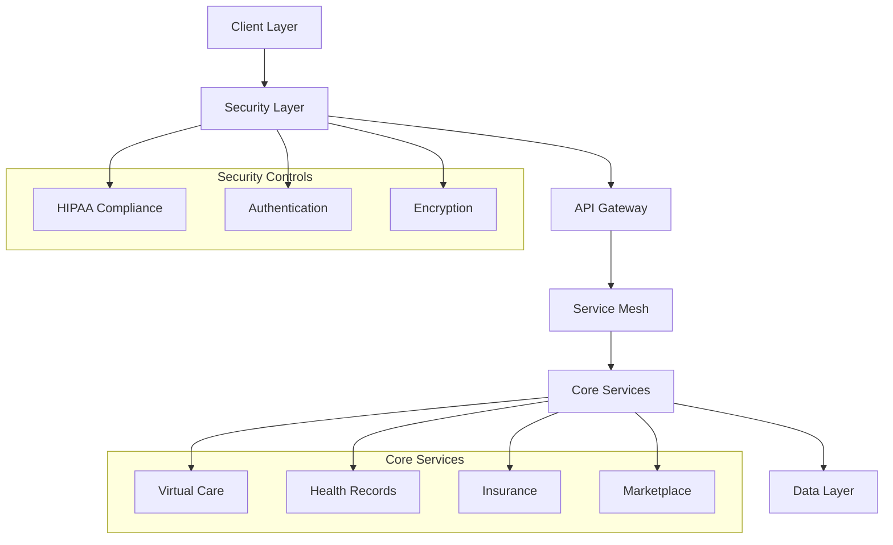
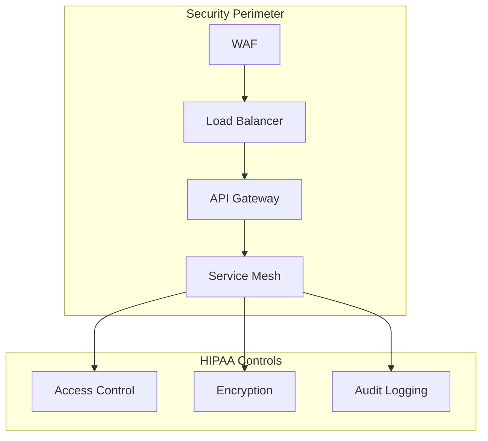

# AUSTA SuperApp Healthcare Platform

[](workflows/backend.yml)
[](security/hipaa-compliance.md)
[](security/security-rating.md)

## Quick Links
- [HIPAA Compliance Documentation](docs/compliance/hipaa.md)
- [Security Protocols](docs/security/protocols.md)
- [API Security Specification](docs/api/security-spec.yaml)

## Project Overview

AUSTA SuperApp is a transformative digital healthcare platform that revolutionizes healthcare service delivery through an integrated mobile and web application. The platform combines telemedicine capabilities, comprehensive health records management, insurance operations, and digital therapeutic services while maintaining strict HIPAA compliance and security standards.

### Key Features
- HIPAA-compliant telemedicine services
- Secure health records management
- Insurance claims processing
- Digital therapeutic marketplace
- Enterprise system integration



## Getting Started

### Prerequisites
- Node.js 18+ (with latest security patches)
- Docker 24+ (with security scanning enabled)
- Kubernetes 1.27+ (with pod security policies)
- AWS CLI 2.0+ (with IAM security configuration)

### Environment Setup

1. Clone the repository with security verification:
```bash
git clone --verify-signatures https://github.com/austa/superapp.git
cd superapp
```

2. Configure HIPAA-compliant environment:
```bash
# Load secure environment configuration
source ./scripts/secure-env-setup.sh

# Verify security configurations
npm run security-check
```

3. Install dependencies with security audit:
```bash
npm ci --audit
```

4. Start development environment with security controls:
```bash
npm run dev:secure
```

## Project Structure

```
austa-superapp/
├── src/
│   ├── backend/           # HIPAA-compliant backend services
│   ├── frontend/          # Secure frontend applications
│   ├── shared/            # Common secure utilities
│   └── infrastructure/    # Secure cloud configurations
├── docs/
│   ├── compliance/        # HIPAA compliance documentation
│   ├── security/          # Security protocols
│   └── api/              # API security specifications
├── tests/
│   ├── security/         # Security test suites
│   └── compliance/       # Compliance test suites
└── infrastructure/
    ├── kubernetes/       # Secure K8s configurations
    └── terraform/        # Secure cloud infrastructure
```

## Development

### Security-First Development Workflow

1. Create security-compliant feature branch:
```bash
git checkout -b feature/secure-feature-name
```

2. Implement with security checks:
```bash
# Run security linting
npm run lint:security

# Run HIPAA compliance checks
npm run check:hipaa
```

3. Submit security-verified PR:
```bash
# Verify security requirements
npm run verify:security

# Create signed commit
git commit -S -m "feat: Add secure feature"
```

### Security Standards

- All code must pass HIPAA compliance checks
- Mandatory security review for PRs
- Signed commits required
- Regular security dependency updates

## Deployment

### HIPAA-Compliant Deployment Process

1. Security verification:
```bash
npm run verify:deployment
```

2. HIPAA compliance check:
```bash
npm run check:hipaa-deployment
```

3. Secure deployment:
```bash
npm run deploy:secure
```

### Infrastructure Security



## Security

### HIPAA Compliance

- End-to-end encryption for PHI
- Role-based access control
- Audit logging and monitoring
- Regular security assessments

### Authentication & Authorization

- OAuth 2.0 with PKCE
- Multi-factor authentication
- JWT with short expiration
- Session management

### Data Protection

- AES-256 encryption at rest
- TLS 1.3 in transit
- Secure key management
- Regular security audits

## Contributing

Please read our [Security-First Contributing Guidelines](CONTRIBUTING.md) for details on our secure development process and HIPAA compliance requirements.

## License

This project is licensed under the [HIPAA-Compliant License](LICENSE) - see the LICENSE file for details.

---

For detailed security documentation and HIPAA compliance information, please refer to our [Security Documentation](docs/security/README.md).