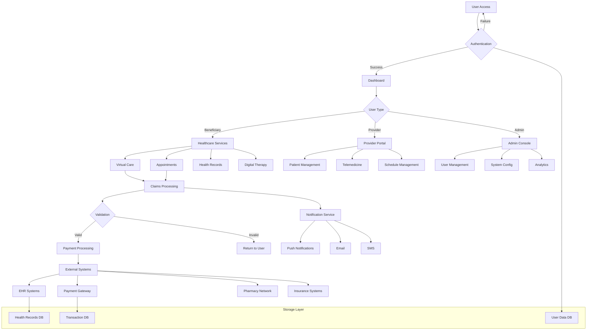
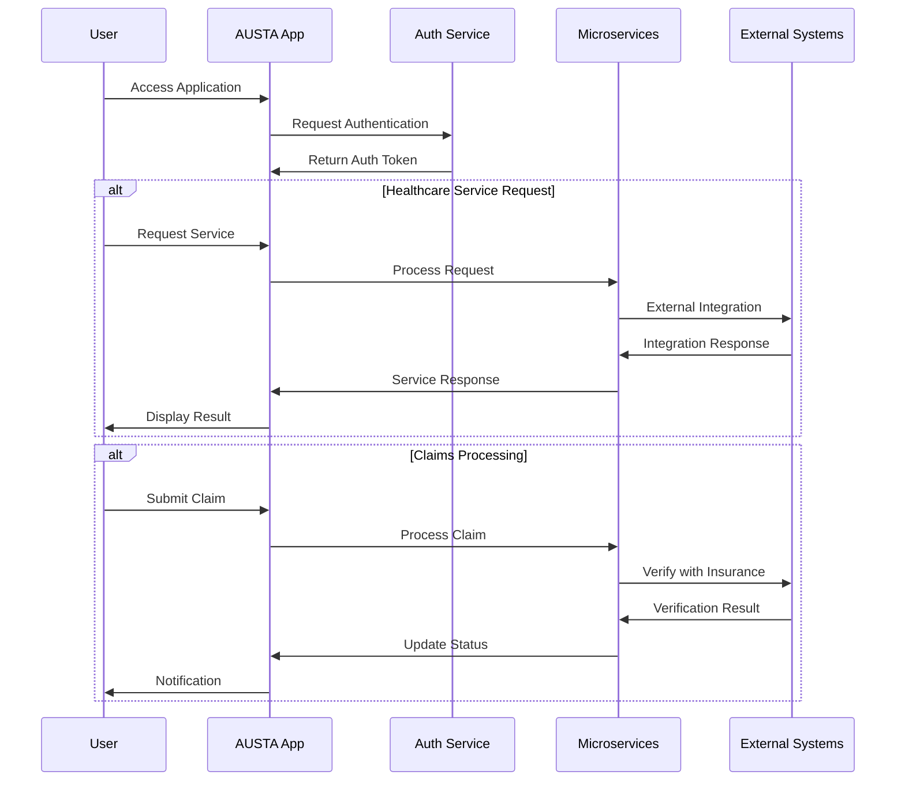
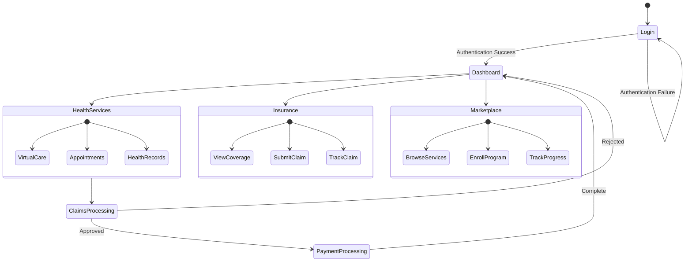
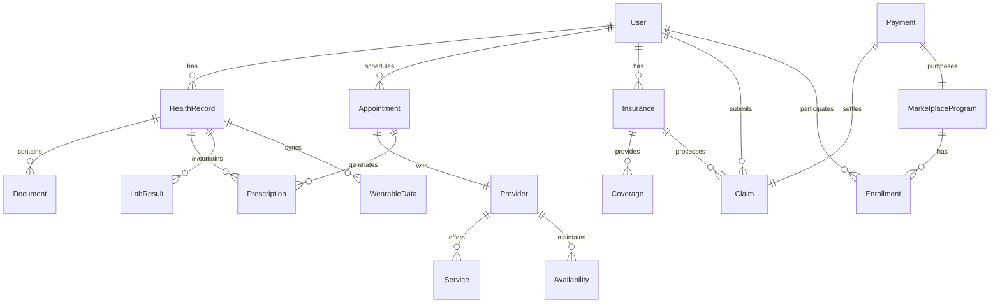
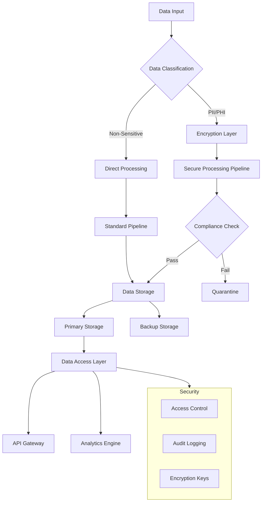

# Product Requirements Document (PRD)

# 1. INTRODUCTION

## 1.1 Purpose

This Software Requirements Specification (SRS) document provides a comprehensive description of the AUSTA SuperApp healthcare platform. It details the functional and non-functional requirements for developers, system architects, QA teams, project managers, and stakeholders involved in the development and deployment of the platform.

## 1.2 Scope

The AUSTA SuperApp is an integrated digital healthcare platform that encompasses:

**Core System Components**

- Native mobile applications for iOS and Android
- Progressive Web Application (PWA) for desktop access
- Microservices-based backend infrastructure
- Real-time communication and notification systems
- Secure payment processing gateway
- Electronic Health Records (EHR) integration layer

**Key Functionalities**

- Virtual care delivery through telemedicine
- Appointment scheduling and management
- Digital health records management
- Insurance claims processing
- Digital therapy marketplace
- Administrative dashboards
- Real-time health monitoring via wearables

**Integration Points**

- Healthcare provider systems
- Pharmacy networks
- Payment processors
- Corporate HR systems
- Wearable device APIs
- Analytics platforms

**Security Framework**

- HIPAA and LGPD compliant infrastructure
- End-to-end encryption
- Multi-factor authentication
- Audit logging and monitoring
- Role-based access control

The platform will be deployed on cloud infrastructure using AWS or Azure, with global CDN support and distributed database systems to ensure high availability and performance across all regions of operation.

# 2. PRODUCT DESCRIPTION

## 2.1 Product Perspective

The AUSTA SuperApp operates as a comprehensive healthcare ecosystem within the broader healthcare infrastructure:

- **Integration Layer**

  - Interfaces with existing healthcare provider EHR systems
  - Connects to national healthcare databases and registries
  - Links with pharmacy networks and medication databases
  - Integrates with insurance claim processing systems
  - Connects to payment gateways and financial institutions

- **Deployment Architecture**

  - Cloud-native implementation on AWS/Azure infrastructure
  - Microservices-based backend with containerized deployments
  - Distributed database system across multiple regions
  - Global CDN for content delivery optimization
  - Real-time communication infrastructure for telemedicine

## 2.2 Product Functions

- **Healthcare Service Delivery**

  - Virtual consultations through integrated video platform
  - Appointment scheduling and management
  - Digital prescription management
  - Emergency care coordination
  - Health monitoring via wearable integration

- **Health Information Management**

  - Electronic health records storage and retrieval
  - Medical document management
  - Lab result integration and visualization
  - Medication tracking and reminders
  - Secure record sharing

- **Insurance Operations**

  - Coverage verification and management
  - Claims processing and tracking
  - Pre-authorization workflows
  - Reimbursement management
  - Digital insurance card access

- **Digital Marketplace**

  - Therapy program enrollment
  - Wellness resource access
  - Health coaching services
  - Educational content delivery
  - Provider service listings

## 2.3 User Characteristics

| User Type | Technical Expertise | Usage Pattern | Key Requirements |
| --- | --- | --- | --- |
| Individual Beneficiaries | Low to Medium | Daily/Weekly | Simple interface, clear navigation |
| Corporate Administrators | Medium to High | Daily | Advanced reporting, bulk management |
| Healthcare Providers | Medium | Daily | Quick access, efficient workflows |
| Insurance Administrators | High | Daily | Detailed controls, audit capabilities |
| Elderly Users | Low | Weekly | Simplified UI, accessibility features |
| Support Staff | Medium to High | Daily | Complete system visibility |

## 2.4 Constraints

- **Regulatory**

  - LGPD compliance requirements
  - HIPAA standards adherence
  - Medical data privacy regulations
  - Financial transaction regulations
  - Healthcare provider licensing requirements

- **Technical**

  - Real-time video quality limitations
  - Mobile device compatibility constraints
  - Network bandwidth requirements
  - Storage capacity limitations
  - Integration capabilities with legacy systems

- **Operational**

  - 24/7 availability requirement
  - Maximum system downtime limits
  - Data backup frequency requirements
  - Support response time SLAs
  - Change management restrictions

## 2.5 Assumptions and Dependencies

**Assumptions**

- Users have access to smartphones or computers with internet connectivity
- Healthcare providers maintain updated availability calendars
- Third-party services maintain specified uptime SLAs
- Users consent to data sharing for essential functions
- Wearable devices provide accurate health metrics

**Dependencies**

- Third-party EHR system availability
- Payment gateway service reliability
- Healthcare provider participation
- Pharmacy network integration
- Insurance company API stability
- Cloud infrastructure availability
- Mobile platform update cycles
- Regulatory environment stability

# 3. PROCESS FLOWCHART

# 4. FUNCTIONAL REQUIREMENTS

## 4.1 Authentication & User Management

### ID: F001

**Description**: User authentication and authorization system  
**Priority**: P0 (Critical)

| Requirement ID | Requirement Description | Acceptance Criteria |
| --- | --- | --- |
| F001.1 | Multi-factor authentication support | - Email/SMS verification - Biometric authentication - Support for hardware security keys |
| F001.2 | Role-based access control | - Predefined roles for all user types - Granular permission management - Role inheritance support |
| F001.3 | Session management | - Configurable session timeouts - Concurrent session handling - Secure token management |
| F001.4 | Password policies | - Minimum complexity requirements - Regular password rotation - Secure password recovery |

## 4.2 Telemedicine Platform

### ID: F002

**Description**: Virtual healthcare consultation system  
**Priority**: P0 (Critical)

| Requirement ID | Requirement Description | Acceptance Criteria |
| --- | --- | --- |
| F002.1 | Video consultation | - HD video quality - Screen sharing capability - Recording options with consent |
| F002.2 | Virtual waiting room | - Queue management - Estimated wait times - Pre-consultation forms |
| F002.3 | Emergency protocols | - Urgent care prioritization - Emergency service integration - Rapid provider allocation |
| F002.4 | Digital prescription | - E-prescription generation - Digital signature support - Pharmacy network integration |

## 4.3 Health Records Management

### ID: F003

**Description**: Electronic health records system  
**Priority**: P0 (Critical)

| Requirement ID | Requirement Description | Acceptance Criteria |
| --- | --- | --- |
| F003.1 | Medical history tracking | - Chronological record organization - Document categorization - Search functionality |
| F003.2 | Lab results integration | - Automated result import - Visualization tools - Trend analysis |
| F003.3 | Wearable device sync | - Real-time data collection - Multiple device support - Data normalization |
| F003.4 | Record sharing | - Controlled access grants - Audit logging - Revocation management |

## 4.4 Insurance Claims Processing

### ID: F004

**Description**: Claims management and processing system  
**Priority**: P1 (High)

| Requirement ID | Requirement Description | Acceptance Criteria |
| --- | --- | --- |
| F004.1 | Claim submission | - Document upload support - Form validation - Progress tracking |
| F004.2 | Coverage verification | - Real-time eligibility checks - Benefit explanation - Coverage calculator |
| F004.3 | Payment processing | - Multiple payment methods - Automated reimbursement - Transaction history |
| F004.4 | Appeals management | - Appeal submission workflow - Documentation management - Status tracking |

## 4.5 Digital Marketplace

### ID: F005

**Description**: Healthcare service and program marketplace  
**Priority**: P1 (High)

| Requirement ID | Requirement Description | Acceptance Criteria |
| --- | --- | --- |
| F005.1 | Service catalog | - Category organization - Search and filter options - Provider ratings |
| F005.2 | Program enrollment | - Eligibility checks - Payment processing - Progress tracking |
| F005.3 | Content management | - Educational resource library - Content recommendations - Usage analytics |
| F005.4 | Provider integration | - Service listing management - Schedule synchronization - Revenue tracking |

## 4.6 Administrative Console

### ID: F006

**Description**: System administration and monitoring platform  
**Priority**: P1 (High)

| Requirement ID | Requirement Description | Acceptance Criteria |
| --- | --- | --- |
| F006.1 | User management | - Bulk operations support - Access control management - Activity monitoring |
| F006.2 | System configuration | - Feature toggles - Service parameters - Integration settings |
| F006.3 | Analytics dashboard | - Real-time metrics - Custom report generation - Data export capabilities |
| F006.4 | Audit logging | - Comprehensive activity tracking - Log retention policies - Search and filtering |

# 5. NON-FUNCTIONAL REQUIREMENTS

## 5.1 Performance Requirements

| Metric | Requirement | Measurement Criteria |
| --- | --- | --- |
| Response Time | \< 500ms for API calls | 95th percentile of all requests |
| Video Latency | \< 150ms for telemedicine | End-to-end transmission delay |
| Page Load Time | \< 2s for web interface | First contentful paint |
| Database Queries | \< 100ms execution time | 99th percentile of queries |
| Concurrent Users | Support 100,000+ simultaneous | Without performance degradation |
| API Throughput | 10,000 requests/second | Sustained load handling |
| CDN Performance | \< 50ms edge delivery | Global content access |

## 5.2 Safety Requirements

| Category | Requirement | Implementation |
| --- | --- | --- |
| Data Backup | Real-time replication | Multi-region backup with 15-minute RPO |
| Failover | Automatic system recovery | \< 5 minute RTO with hot standby |
| Error Handling | Graceful degradation | Fallback mechanisms for critical functions |
| Data Integrity | Checksums and validation | Data verification at every transaction |
| Audit Trail | Complete action logging | Immutable audit records |
| Emergency Access | Offline mode capabilities | Essential functions without connectivity |
| Disaster Recovery | Business continuity | Geographic redundancy across 3+ regions |

## 5.3 Security Requirements

| Feature | Specification | Details |
| --- | --- | --- |
| Authentication | Multi-factor authentication | Biometric, SMS, email verification |
| Authorization | Role-based access control | Granular permission management |
| Data Encryption | AES-256 for storage | TLS 1.3 for transmission |
| Session Management | 30-minute timeout | Secure token handling |
| API Security | OAuth 2.0 and JWT | Rate limiting and request validation |
| Audit Logging | Comprehensive tracking | All security events recorded |
| Vulnerability Management | Regular scanning | Automated security testing |

## 5.4 Quality Requirements

### 5.4.1 Availability

- 99.99% uptime for core services
- 99.9% for non-critical functions
- Planned maintenance windows \< 4 hours/month
- Automatic failover within 30 seconds

### 5.4.2 Maintainability

- Microservices architecture with independent deployment
- Automated CI/CD pipeline
- Infrastructure as Code (IaC)
- Comprehensive API documentation
- Maximum 24-hour patch deployment time

### 5.4.3 Usability

- WCAG 2.1 Level AA compliance
- Support for multiple languages
- Maximum 3 clicks to core functions
- Consistent UI/UX across platforms
- 98% success rate for critical user journeys

### 5.4.4 Scalability

- Horizontal scaling up to 10x normal load
- Auto-scaling based on CPU/memory metrics
- Database sharding support
- Elastic infrastructure adjustment
- Zero-downtime scaling operations

### 5.4.5 Reliability

- Mean Time Between Failures (MTBF) \> 720 hours
- Mean Time To Recovery (MTTR) \< 10 minutes
- Error rate \< 0.1% for all transactions
- 100% data consistency across replicas
- Zero data loss guarantee

## 5.5 Compliance Requirements

| Regulation | Requirement | Implementation |
| --- | --- | --- |
| LGPD | Data privacy compliance | User consent management, data minimization |
| HIPAA | Healthcare data protection | PHI encryption, access controls |
| ISO 27001 | Information security | Security management framework |
| PCI DSS | Payment security | Secure payment processing |
| WCAG 2.1 | Accessibility | Interface accessibility standards |
| SOC 2 | Security controls | Regular audit and certification |
| CFM/CRM | Medical regulations | Provider credential verification |

# 6. DATA REQUIREMENTS

## 6.1 Data Models

## 6.2 Data Storage

### 6.2.1 Primary Storage Systems

| Data Type | Storage System | Retention Period | Backup Frequency |
| --- | --- | --- | --- |
| User Data | PostgreSQL | 7 years | Real-time |
| Medical Records | MongoDB | 20 years | Hourly |
| Media Files | S3 Compatible Storage | 10 years | Daily |
| Audit Logs | Elasticsearch | 5 years | Continuous |
| Analytics Data | ClickHouse | 2 years | Daily |
| Session Data | Redis | 24 hours | Real-time |

### 6.2.2 Redundancy Configuration

- Multi-region database replication with 3 availability zones
- Cross-region backup storage with 99.999999999% durability
- Hot standby databases with automatic failover
- Read replicas for high-traffic regions
- Geographically distributed cache layers

### 6.2.3 Backup Strategy

- Real-time streaming replication for critical data
- Point-in-time recovery capability up to 35 days
- Daily incremental backups
- Weekly full backups
- Monthly archive snapshots
- Encrypted backup storage with versioning

## 6.3 Data Processing

### 6.3.1 Data Security Measures

| Security Layer | Implementation | Purpose |
| --- | --- | --- |
| Encryption at Rest | AES-256 | Secure storage |
| Encryption in Transit | TLS 1.3 | Secure transmission |
| Key Management | AWS KMS/Azure Key Vault | Key rotation and management |
| Access Control | RBAC + ABAC | Granular permissions |
| Data Masking | Dynamic masking | PII/PHI protection |
| Audit Trail | Immutable logs | Compliance tracking |

### 6.3.2 Data Processing Rules

- Real-time validation of incoming data
- Automatic PII/PHI detection and encryption
- Data normalization for consistent storage
- Version control for medical records
- Automated data lifecycle management
- Compliance checks before storage
- Data quality scoring and validation

### 6.3.3 Data Integration Points

| System | Integration Method | Data Flow |
| --- | --- | --- |
| EHR Systems | HL7 FHIR | Bi-directional |
| Payment Processors | REST APIs | One-way (in) |
| Insurance Systems | SOAP/REST | Bi-directional |
| Analytics Platform | Event Streaming | One-way (out) |
| Wearable Devices | WebSocket | One-way (in) |
| Pharmacy Networks | REST APIs | Bi-directional |

# 7. EXTERNAL INTERFACES

## 7.1 User Interfaces

### 7.1.1 Mobile Applications (iOS/Android)

| Interface Component | Requirements |
| --- | --- |
| Navigation | - Bottom tab navigation with 5 main sections - Side drawer for additional features - Quick action floating buttons |
| Authentication | - Biometric login support - Password/PIN options - Multi-factor authentication screens |
| Dashboard | - Customizable widgets - Health metrics visualization - Appointment/medication reminders |
| Video Interface | - Full-screen video consultation mode - Picture-in-picture support - Screen sharing capabilities |
| Accessibility | - VoiceOver/TalkBack support - Dynamic text sizing - High contrast modes |

### 7.1.2 Web Application (PWA)

| Interface Component | Requirements |
| --- | --- |
| Responsive Design | - Breakpoints: 320px, 768px, 1024px, 1440px - Fluid layouts - Print-friendly views |
| Navigation | - Horizontal main menu - Breadcrumb navigation - Search functionality |
| Administrative Console | - Data tables with sorting/filtering - Bulk action capabilities - Export functions |
| Dashboard | - Configurable layouts - Real-time updates - Interactive charts |

## 7.2 Hardware Interfaces

### 7.2.1 Medical Devices

| Device Type | Interface Specifications |
| --- | --- |
| Wearables | - Bluetooth Low Energy 5.0 - Standard health data formats (FHIR) - Battery optimization protocols |
| Diagnostic Devices | - USB connectivity support - Direct data transfer protocols - Device firmware management |
| Biometric Sensors | - Fingerprint reader API integration - Face ID/Touch ID compatibility - Secure element access |

### 7.2.2 Infrastructure Hardware

| Component | Specifications |
| --- | --- |
| Load Balancers | - AWS ELB/Azure Load Balancer integration - Health check endpoints - SSL termination |
| Storage Systems | - SSD-based primary storage - NVMe support for high-performance data - RAID configuration for redundancy |
| Network Hardware | - 10Gbps minimum network interfaces - Hardware firewall integration - VPN endpoint support |

## 7.3 Software Interfaces

### 7.3.1 External System Integration

| System Type | Interface Specifications |
| --- | --- |
| EHR Systems | - HL7 FHIR R4 compliance - REST API endpoints - Real-time data synchronization |
| Payment Processors | - PCI-DSS compliant interfaces - Tokenization support - Webhook notifications |
| Insurance Systems | - SOAP/REST API support - Batch processing capabilities - Error handling protocols |

### 7.3.2 Third-Party Services

| Service | Integration Requirements |
| --- | --- |
| Analytics | - Google Analytics 4 - Custom event tracking - Real-time data streaming |
| Notification Services | - Firebase Cloud Messaging - Apple Push Notification Service - SMS gateway integration |
| Storage Services | - AWS S3/Azure Blob Storage - CDN integration - Lifecycle management |

## 7.4 Communication Interfaces

### 7.4.1 Network Protocols

| Protocol | Specifications |
| --- | --- |
| HTTP/HTTPS | - TLS 1.3 minimum - Certificate pinning - HSTS implementation |
| WebSocket | - Secure WebSocket (WSS) - Heartbeat mechanism - Auto-reconnection |
| gRPC | - Protocol buffers v3 - Bi-directional streaming - Load balancing support |

### 7.4.2 API Specifications

| API Type | Requirements |
| --- | --- |
| REST APIs | - OpenAPI 3.0 specification - JWT authentication - Rate limiting |
| GraphQL | - Schema-first design - Persisted queries - Automatic documentation |
| Event Streams | - Apache Kafka integration - Event versioning - Dead letter queues |

### 7.4.3 Data Formats

| Format | Specifications |
| --- | --- |
| JSON | - Schema validation - Compression support - UTF-8 encoding |
| HL7 FHIR | - R4 resource types - Custom extensions - Bulk data support |
| Binary Data | - Base64 encoding - Chunked transfer - Integrity verification |

# APPENDICES

## A. GLOSSARY

| Term | Definition |
| --- | --- |
| Beneficiary | An individual who receives healthcare services through the AUSTA SuperApp platform |
| Digital Therapy | Online therapeutic programs and interventions delivered through the platform |
| Electronic Health Record (EHR) | Digital version of a patient's medical history maintained by healthcare providers |
| SuperApp | A mobile application that combines multiple services into a single integrated platform |
| Virtual Care | Healthcare services delivered remotely through digital communication channels |
| Wearable Integration | Connection with health monitoring devices for automated data collection |

## B. ACRONYMS

| Acronym | Full Form |
| --- | --- |
| ABAC | Attribute-Based Access Control |
| API | Application Programming Interface |
| AWS | Amazon Web Services |
| CDN | Content Delivery Network |
| CFM | Conselho Federal de Medicina (Federal Council of Medicine) |
| CRM | Conselho Regional de Medicina (Regional Council of Medicine) |
| EHR | Electronic Health Records |
| FHIR | Fast Healthcare Interoperability Resources |
| GDPR | General Data Protection Regulation |
| HIPAA | Health Insurance Portability and Accountability Act |
| HSTS | HTTP Strict Transport Security |
| IaC | Infrastructure as Code |
| JWT | JSON Web Token |
| K8s | Kubernetes |
| LGPD | Lei Geral de Proteção de Dados (General Data Protection Law) |
| MFA | Multi-Factor Authentication |
| NPS | Net Promoter Score |
| PHI | Protected Health Information |
| PII | Personally Identifiable Information |
| PWA | Progressive Web Application |
| RBAC | Role-Based Access Control |
| RPO | Recovery Point Objective |
| RTO | Recovery Time Objective |
| SLA | Service Level Agreement |
| SMS | Short Message Service |
| SOC | System and Organization Controls |
| TLS | Transport Layer Security |
| UI/UX | User Interface/User Experience |
| WCAG | Web Content Accessibility Guidelines |

## C. ADDITIONAL REFERENCES

### Technical Standards

- HL7 FHIR Implementation Guide v4.0.1
- OAuth 2.0 Authorization Framework (RFC 6749)
- OpenAPI Specification v3.0.3
- WebRTC 1.0: Real-Time Communication Between Browsers

### Regulatory Guidelines

- LGPD Compliance Framework
- HIPAA Security Rule Implementation Guide
- PCI DSS v4.0 Requirements
- WCAG 2.1 Accessibility Guidelines

### Development Resources

- AWS Well-Architected Framework
- Kubernetes Documentation
- Microservices Architecture Patterns
- React Native Best Practices Guide

### Security Standards

- OWASP Security Verification Standard
- NIST Cybersecurity Framework
- ISO 27001:2013 Requirements
- Cloud Security Alliance Guidelines