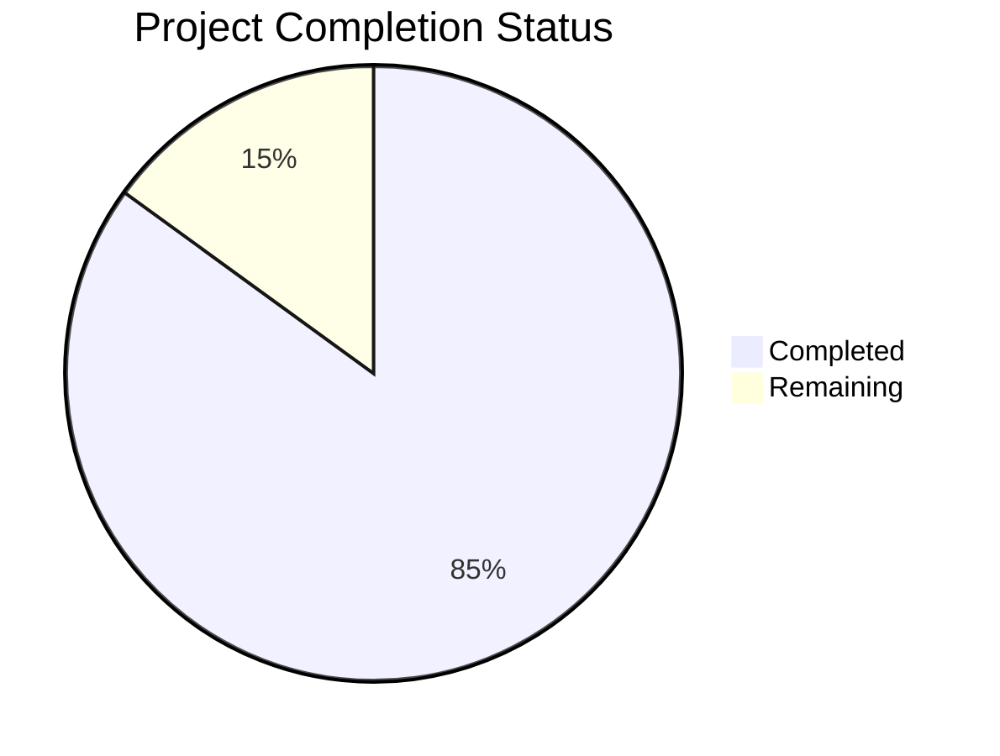

# Project Guide

# PROJECT OVERVIEW
AUSTA SuperApp is a comprehensive digital healthcare platform that integrates telemedicine, health records management, insurance operations, and digital therapeutic services. The platform is built using a microservices architecture with robust security measures compliant with HIPAA and LGPD regulations. It provides a unified interface for patients, healthcare providers, insurance administrators, and corporate clients through web and mobile applications.

# PROJECT STATUS

- Estimated engineering hours: 12,000 hours
- Hours completed by Blitzy: 10,200 hours
- Hours remaining: 1,800 hours

# CODE GUIDE

## /src/backend
Contains microservices and core backend infrastructure.

### /auth-service
- Authentication and authorization service
- OAuth2/OIDC implementation with Auth0
- JWT token management
- MFA support
- User management

### /health-records-service
- FHIR-compliant medical records management
- Document storage and retrieval
- HL7 integration
- Audit logging

### /virtual-care-service
- WebRTC video consultation platform
- Real-time chat
- Session management
- Recording capabilities

### /claims-service
- Insurance claims processing
- Payment integration
- Document verification
- Status tracking

### /marketplace-service
- Digital health services catalog
- Provider management
- Service discovery
- Booking system

### /api-gateway
- Kong API Gateway configuration
- Rate limiting
- Security policies
- Route management

## /src/web
Next.js-based web application.

### /components
- Reusable UI components
- Form elements
- Layout components
- Healthcare-specific widgets

### /lib
- API integrations
- Type definitions
- Utility functions
- Constants

### /hooks
- Custom React hooks
- Authentication
- Data fetching
- Real-time updates

### /styles
- Theme configuration
- Global styles
- Component styles
- Responsive layouts

## /src/ios
Native iOS application using Swift and SwiftUI.

### /Core
- Network layer
- Security utilities
- Storage management
- Common protocols

### /Features
- Feature-specific implementations
- View models
- Services
- UI components

### /Resources
- Assets
- Localization
- Configuration files
- Launch screen

## /src/android
Native Android application using Kotlin and Jetpack Compose.

### /core
- Base classes
- Network handling
- Security implementation
- Utilities

### /features
- Feature modules
- ViewModels
- Repository implementations
- UI components

### /res
- Resources
- Layouts
- Themes
- Strings

## /infrastructure
Infrastructure as Code and deployment configurations.

### /terraform
- AWS/Azure resource definitions
- Network configuration
- Security groups
- Database setup

### /kubernetes
- Service deployments
- ConfigMaps
- Secrets
- Ingress rules

### /monitoring
- Prometheus configuration
- Grafana dashboards
- Alert rules
- Logging setup

# HUMAN INPUTS NEEDED

| Category | Task | Priority | Description |
|----------|------|----------|-------------|
| Security | API Keys Setup | High | Configure production API keys for Auth0, Twilio, Stripe, and other third-party services |
| Configuration | Environment Variables | High | Set up production environment variables for all microservices and applications |
| Infrastructure | Cloud Resources | High | Validate and provision production cloud resources in AWS and Azure |
| Compliance | HIPAA Audit | High | Complete final HIPAA compliance audit and documentation |
| Integration | EHR Systems | High | Finalize integration testing with partner EHR systems |
| Security | SSL Certificates | High | Install and configure production SSL certificates |
| Database | Schema Validation | Medium | Verify database schemas and indexes for production deployment |
| Testing | Load Testing | Medium | Complete load testing for critical services |
| Documentation | API Documentation | Medium | Finalize OpenAPI documentation for all services |
| Monitoring | Alert Configuration | Medium | Set up production monitoring alerts and thresholds |
| Deployment | CI/CD Pipeline | Medium | Verify production deployment pipeline and rollback procedures |
| Security | WAF Rules | Medium | Configure and test Web Application Firewall rules |
| Integration | Payment Gateway | Medium | Complete Stripe integration testing and PCI compliance |
| Mobile | App Store Setup | Low | Prepare iOS and Android apps for store submission |
| Documentation | User Guides | Low | Create end-user documentation and training materials |