# Technical Specifications

# 1. INTRODUCTION

## 1.1 EXECUTIVE SUMMARY

The AUSTA SuperApp represents a transformative digital healthcare platform designed to revolutionize healthcare service delivery through an integrated mobile and web application. By combining telemedicine capabilities, comprehensive health records management, insurance operations, and digital therapeutic services, the platform addresses the critical need for seamless, secure, and efficient healthcare access in the digital age.

This solution targets the fragmentation in current healthcare delivery systems by providing a unified platform that connects beneficiaries, healthcare providers, insurance administrators, and corporate clients. The platform's microservices architecture ensures scalability, while bank-grade security measures protect sensitive health information in compliance with HIPAA and LGPD regulations.

## 1.2 SYSTEM OVERVIEW

### Project Context

| Aspect | Description |
| --- | --- |
| Market Position | Leading integrated healthcare platform in the digital health ecosystem |
| Current Limitations | Fragmented healthcare services, manual processes, limited digital access |
| Enterprise Integration | Seamless connection with existing EHR systems, insurance platforms, and corporate systems |

### High-Level Description

| Component | Capabilities |
| --- | --- |
| Virtual Care Platform | Secure video consultations, AI-powered triage, digital prescriptions |
| Health Records System | Comprehensive EHR management, wearable integration, document handling |
| Insurance Operations | Claims processing, coverage verification, reimbursement management |
| Digital Marketplace | Therapeutic programs, wellness resources, provider services |
| Administrative Console | User management, analytics, compliance monitoring |

### Success Criteria

| Category | Metrics |
| --- | --- |
| User Adoption | - 50% monthly active user growth<br>- 80% user retention rate<br>- NPS score \> 50 |
| Technical Performance | - 99.99% platform availability<br>- \< 500ms average response time<br>- Zero security breaches |
| Business Impact | - 30% reduction in claims processing time<br>- 40% increase in virtual consultations<br>- 25% cost reduction in healthcare delivery |

## 1.3 SCOPE

### In-Scope Elements

#### Core Features and Functionalities

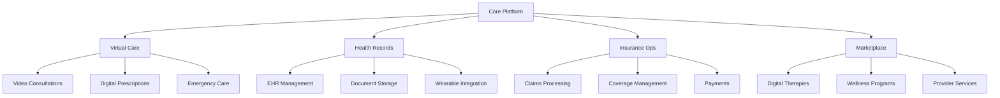

#### Implementation Boundaries

| Domain | Coverage |
| --- | --- |
| User Groups | - Individual beneficiaries<br>- Healthcare providers<br>- Corporate administrators<br>- Insurance personnel |
| Geographic Scope | - Initial launch in major metropolitan areas<br>- Phased expansion to regional markets |
| Data Domains | - Medical records<br>- Insurance information<br>- Payment data<br>- User profiles |
| Technical Coverage | - iOS and Android mobile apps<br>- Progressive web application<br>- Administrative console |

### Out-of-Scope Elements

| Category | Excluded Elements |
| --- | --- |
| Features | - Complex medical imaging processing<br>- Medical device direct control<br>- Automated medical diagnosis<br>- Research data analytics |
| Integrations | - Legacy hospital management systems<br>- Non-standard medical devices<br>- International healthcare networks |
| Use Cases | - Clinical trial management<br>- Medical education delivery<br>- Pharmaceutical development<br>- Medical equipment management |
| Future Considerations | - Blockchain integration<br>- AR/VR consultations<br>- Genomic data analysis<br>- IoT device ecosystem |

# 2. SYSTEM ARCHITECTURE

## 2.1 High-Level Architecture

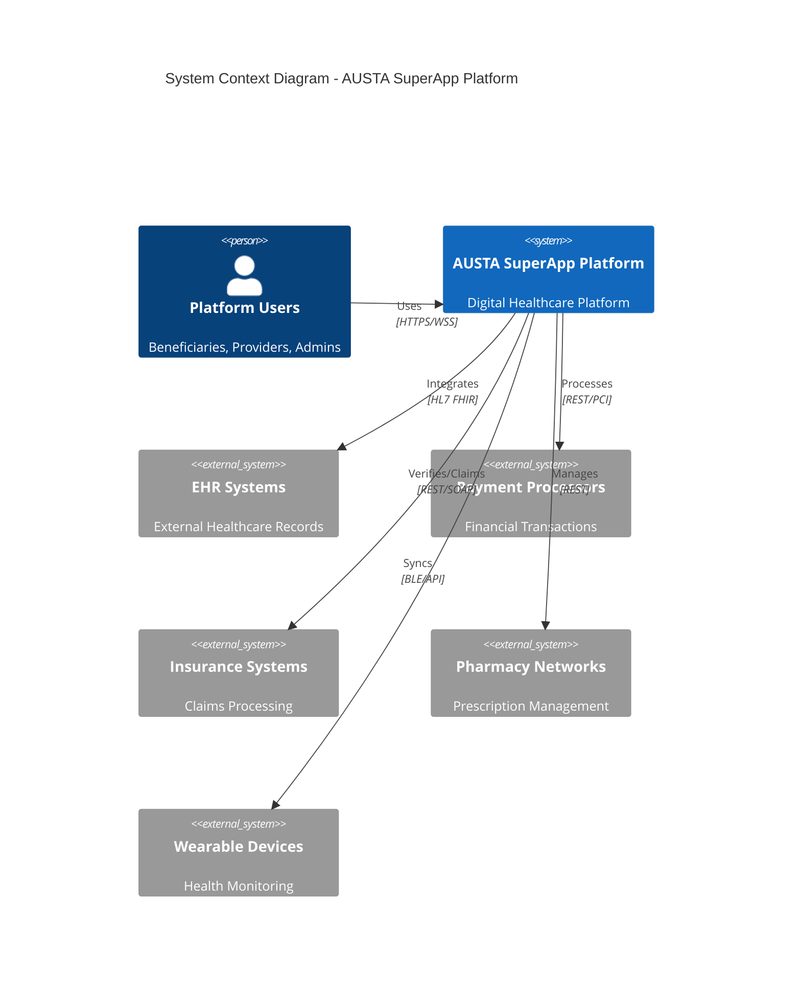

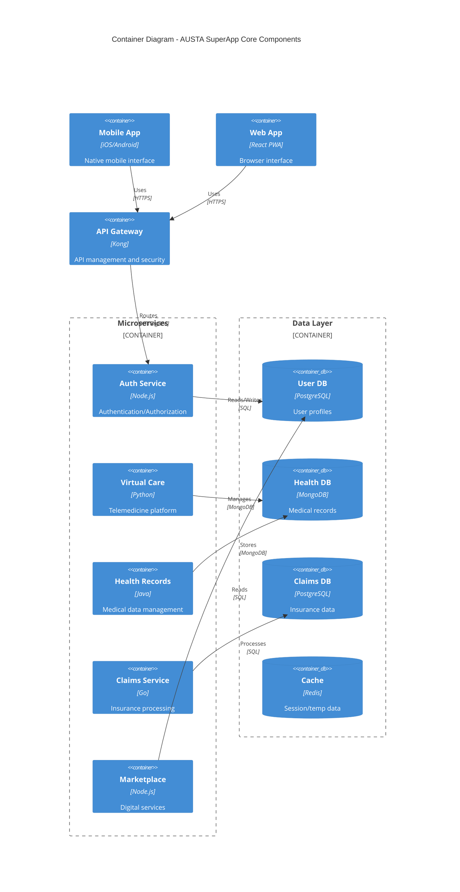

## 2.2 Component Details

### Core Service Components

| Component | Purpose | Technology Stack | Scaling Strategy |
| --- | --- | --- | --- |
| Auth Service | Identity management | Node.js, JWT, OAuth2 | Horizontal with session stickiness |
| Virtual Care | Telemedicine platform | Python, WebRTC, Redis | Auto-scaling based on active sessions |
| Health Records | Medical data management | Java Spring, FHIR | Horizontal with read replicas |
| Claims Service | Insurance processing | Go, gRPC | Event-driven with queue-based scaling |
| Marketplace | Digital services platform | Node.js, GraphQL | Horizontal with CDN caching |

### Data Storage Solutions

| Store Type | Technology | Purpose | Scaling Approach |
| --- | --- | --- | --- |
| Primary DB | PostgreSQL | Transactional data | Master-slave replication |
| Document Store | MongoDB | Medical records | Sharding by patient ID |
| Cache Layer | Redis Cluster | Session management | Memory-based scaling |
| Object Storage | S3-compatible | Media storage | CDN distribution |
| Search Engine | Elasticsearch | Full-text search | Index partitioning |

## 2.3 Technical Decisions

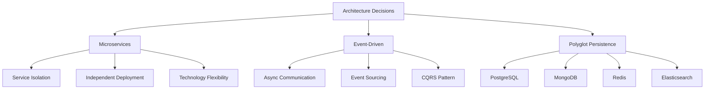

## 2.4 Cross-Cutting Concerns

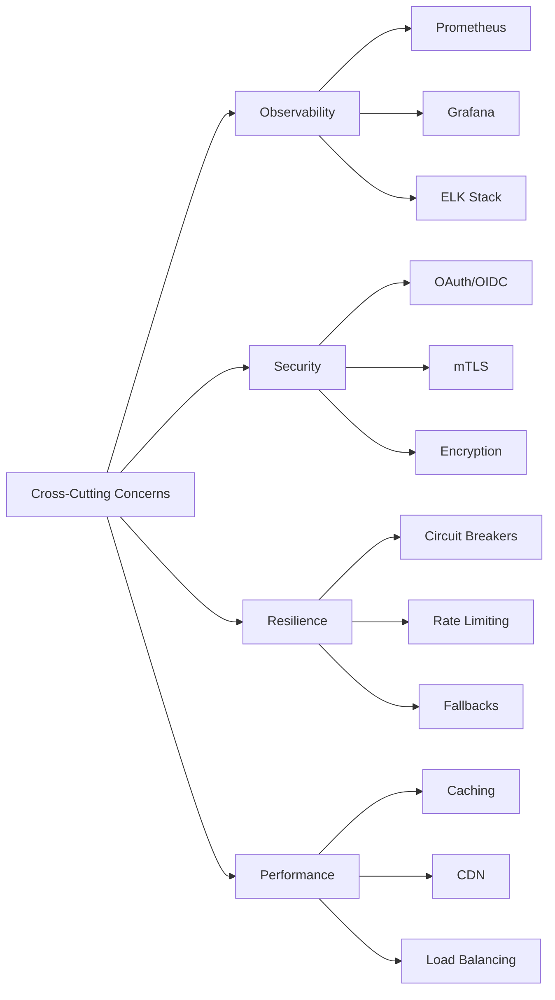

## 2.5 Deployment Architecture

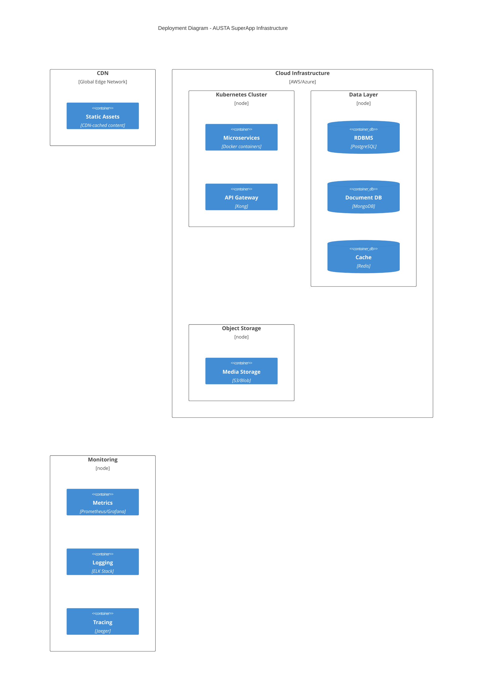

# 3. SYSTEM COMPONENTS ARCHITECTURE

## 3.1 USER INTERFACE DESIGN

### 3.1.1 Design Specifications

| Category | Requirements |
| --- | --- |
| Visual Hierarchy | - F-pattern layout for content organization<br>- Z-pattern for landing pages<br>- Maximum 3 levels of information hierarchy |
| Design System | - Material Design 3.0 components<br>- Custom healthcare-specific components<br>- Atomic design methodology |
| Responsive Design | - Mobile-first approach<br>- Breakpoints: 320px, 768px, 1024px, 1440px<br>- Fluid typography (16px base) |
| Accessibility | - WCAG 2.1 Level AA compliance<br>- Minimum contrast ratio 4.5:1<br>- Screen reader optimization |
| Device Support | - iOS 14+ (iPhone/iPad)<br>- Android 10+<br>- Chrome 90+, Safari 14+, Firefox 90+, Edge 90+ |

### 3.1.2 Interface Elements

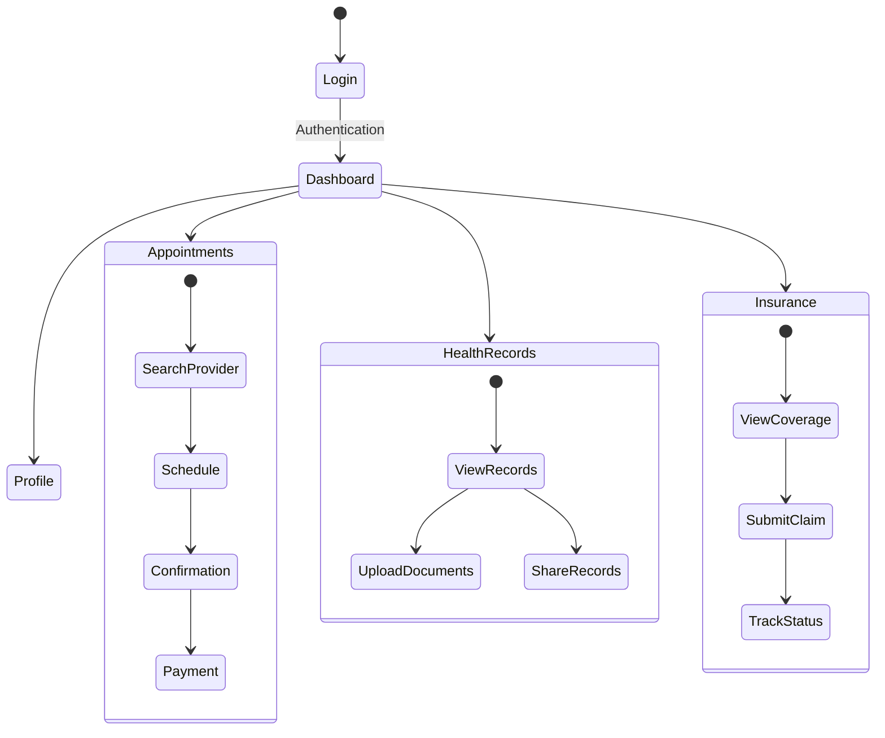

### 3.1.3 Critical User Flows

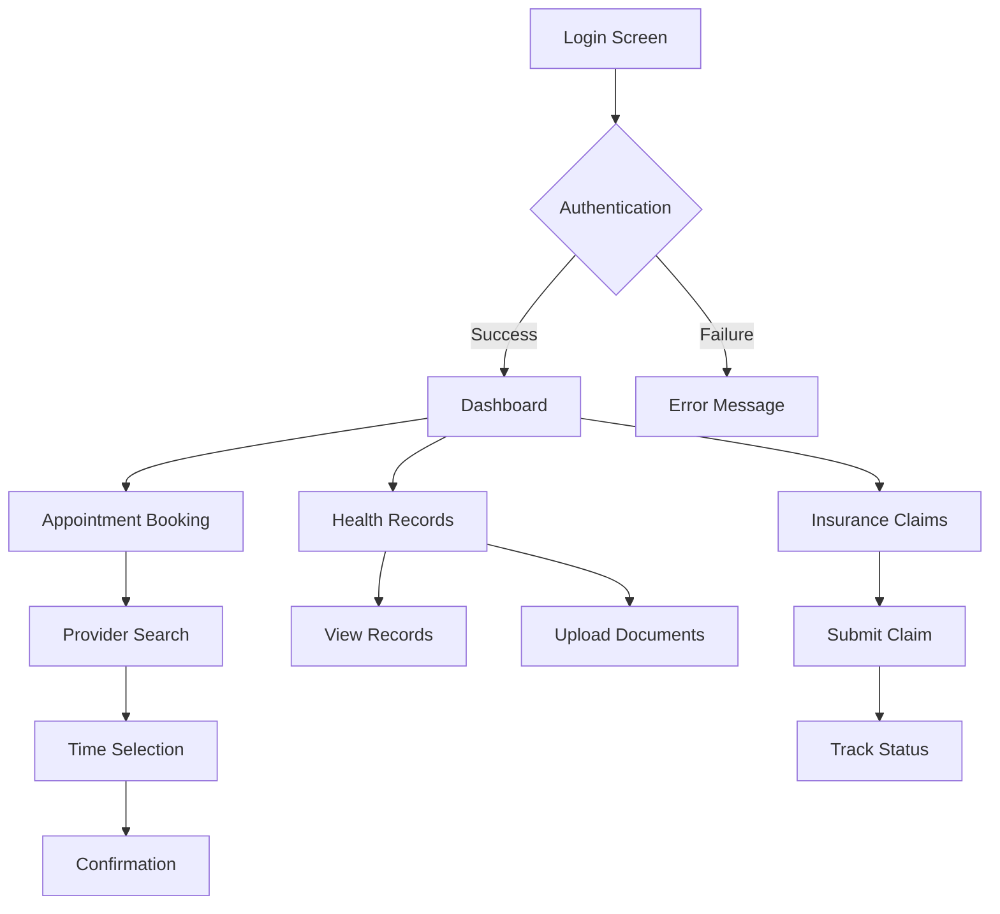

## 3.2 DATABASE DESIGN

### 3.2.1 Schema Design

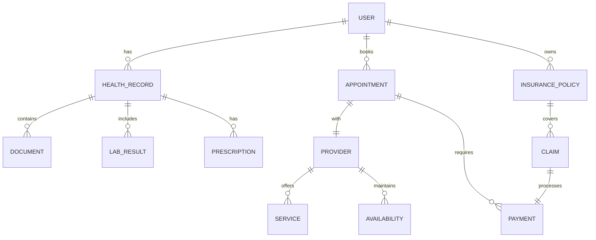

### 3.2.2 Data Management Strategy

| Aspect | Implementation |
| --- | --- |
| Partitioning | - Range partitioning by date for appointments<br>- Hash partitioning for user data<br>- List partitioning for geographic distribution |
| Backup | - Continuous replication to standby<br>- Daily full backups<br>- 30-minute incremental backups |
| Retention | - Active data: 2 years online<br>- Archive data: 20 years cold storage<br>- Audit logs: 7 years |
| Privacy | - Column-level encryption for PII<br>- Data masking for non-privileged access<br>- Automated PII detection |

### 3.2.3 Performance Optimization

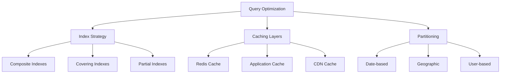

## 3.3 API DESIGN

### 3.3.1 API Architecture

| Component | Specification |
| --- | --- |
| Protocol | REST over HTTPS, WebSocket for real-time |
| Authentication | OAuth 2.0 with JWT tokens |
| Rate Limiting | - 1000 requests/minute for standard users<br>- 5000 requests/minute for premium users |
| Versioning | URI versioning (v1, v2) |
| Documentation | OpenAPI 3.0 specification |

### 3.3.2 Interface Specifications

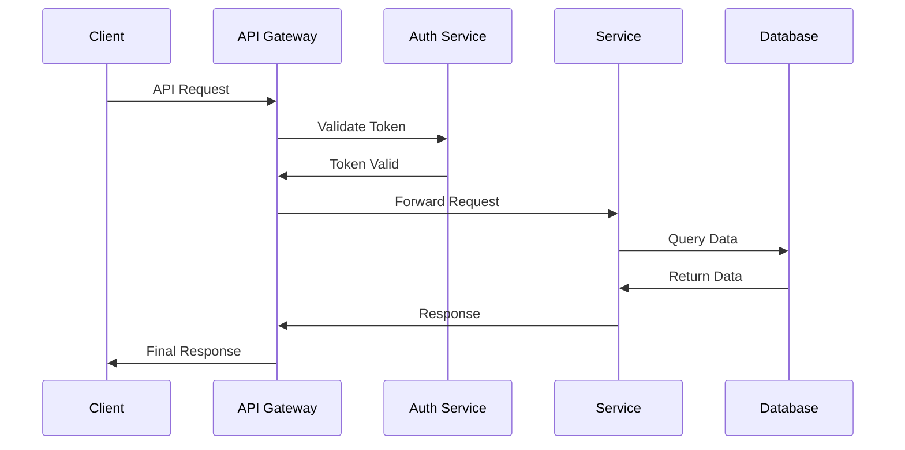

### 3.3.3 Integration Requirements

| System | Integration Method | Requirements |
| --- | --- | --- |
| EHR Systems | HL7 FHIR API | - FHIR R4 compliance<br>- Bulk data support<br>- Resource validation |
| Payment Gateway | REST API | - PCI DSS compliance<br>- 3D Secure support<br>- Tokenization |
| Insurance Systems | SOAP/REST | - Real-time eligibility<br>- Claim status updates<br>- Batch processing |
| Pharmacy Network | REST API | - e-Prescription standard<br>- Real-time inventory<br>- Digital signature |

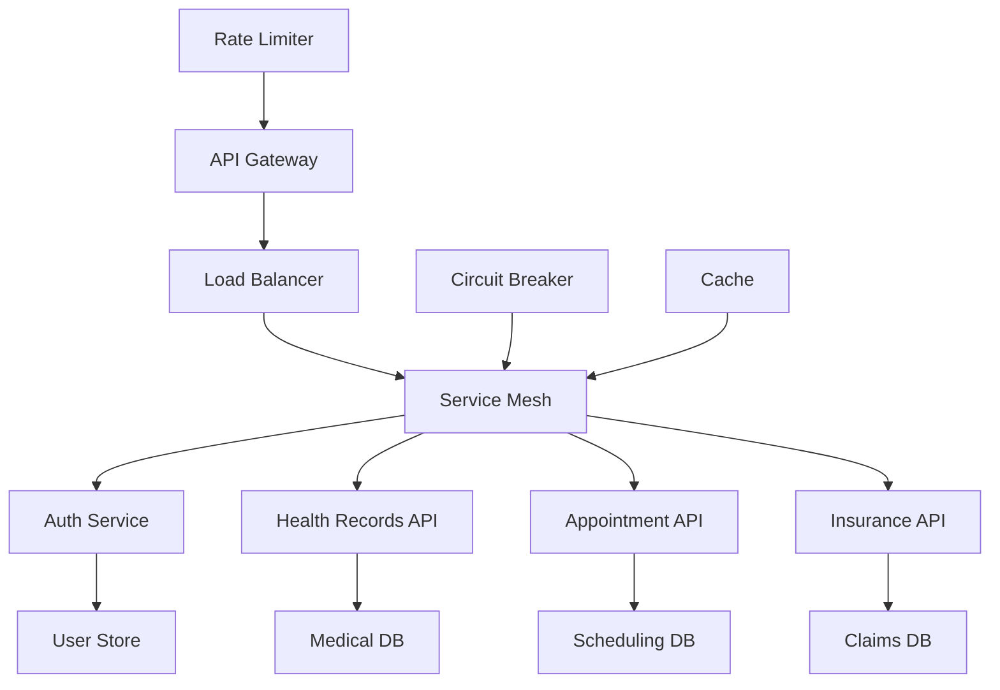

# 4. TECHNOLOGY STACK

## 4.1 PROGRAMMING LANGUAGES

| Platform/Component | Language | Version | Justification |
| --- | --- | --- | --- |
| iOS Native | Swift | 5.9+ | - Modern Apple ecosystem support<br>- Native performance for video calls<br>- Strong type safety for healthcare data |
| Android Native | Kotlin | 1.9+ | - Official Android development language<br>- Coroutines for async operations<br>- Interoperability with Java libraries |
| Backend Services | Java | 17 LTS | - Enterprise-grade stability<br>- Rich healthcare integration libraries<br>- Strong HIPAA compliance tools |
| Real-time Services | Go | 1.21+ | - High-performance for WebSocket connections<br>- Efficient resource utilization<br>- Built-in concurrency |
| Data Processing | Python | 3.11+ | - Rich data science libraries<br>- ML/AI capabilities<br>- Healthcare analytics tools |
| Web Frontend | TypeScript | 5.0+ | - Type safety for complex healthcare workflows<br>- Enhanced developer productivity<br>- Better maintainability |

## 4.2 FRAMEWORKS & LIBRARIES

### Core Frameworks

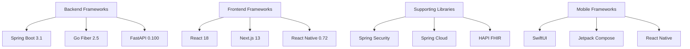

### Framework Selection Justification

| Framework | Purpose | Key Features |
| --- | --- | --- |
| Spring Boot | Microservices Platform | - Enterprise security<br>- HIPAA compliance tools<br>- Healthcare system integrations |
| React/Next.js | Web Frontend | - Server-side rendering<br>- Progressive enhancement<br>- Accessibility support |
| SwiftUI/Jetpack Compose | Native Mobile UI | - Native performance<br>- Platform-specific features<br>- Biometric integration |
| HAPI FHIR | Healthcare Interop | - HL7 FHIR compliance<br>- Medical data validation<br>- Healthcare standards support |

## 4.3 DATABASES & STORAGE

### Primary Data Stores

| Type | Technology | Version | Purpose |
| --- | --- | --- | --- |
| RDBMS | PostgreSQL | 15+ | - Transactional data<br>- User management<br>- Insurance claims |
| Document Store | MongoDB | 6.0+ | - Medical records<br>- Clinical documents<br>- Unstructured health data |
| Cache | Redis Cluster | 7.0+ | - Session management<br>- Real-time data<br>- API caching |
| Search | Elasticsearch | 8.0+ | - Medical search<br>- Analytics<br>- Audit logs |
| Object Storage | AWS S3 | - | - Medical imaging<br>- Document storage<br>- Backup archives |

### Data Architecture

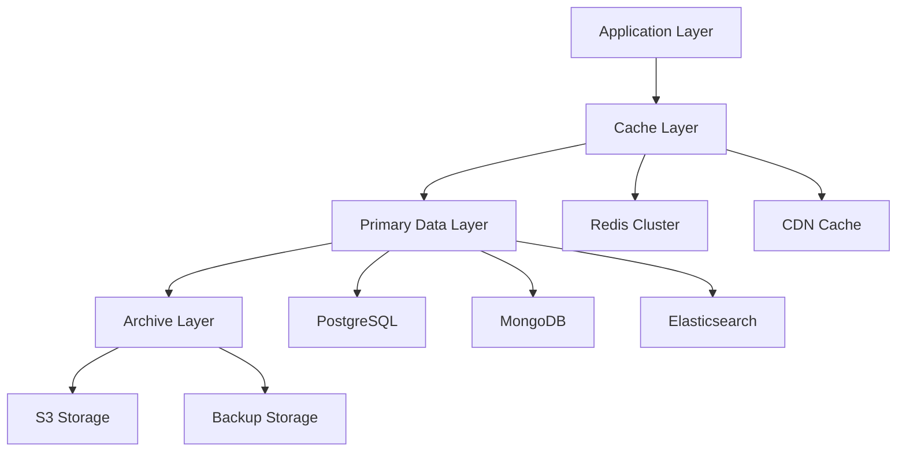

## 4.4 THIRD-PARTY SERVICES

| Category | Service | Purpose | Integration Method |
| --- | --- | --- | --- |
| Authentication | Auth0 | Identity Management | OAuth 2.0/OIDC |
| Video Calls | Twilio | Telemedicine | REST API/WebRTC |
| Payments | Stripe | Payment Processing | REST API/Webhooks |
| Monitoring | Datadog | System Monitoring | Agent-based/API |
| Analytics | Snowflake | Data Warehouse | SDK/API |
| Email/SMS | SendGrid/Twilio | Communications | REST API |
| CDN | Cloudflare | Content Delivery | DNS/API |

## 4.5 DEVELOPMENT & DEPLOYMENT

### Development Pipeline

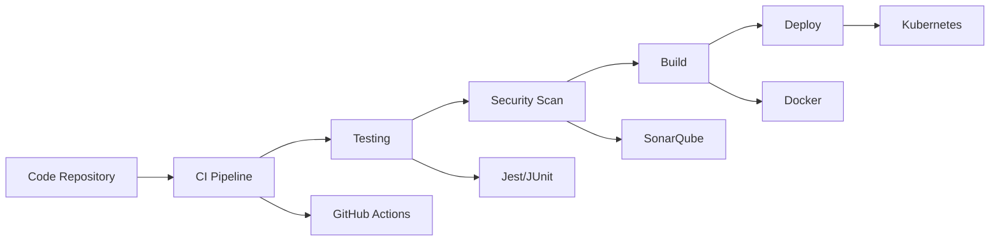

### Infrastructure Tools

| Category | Tool | Version | Purpose |
| --- | --- | --- | --- |
| Container Runtime | Docker | 24.0+ | Application containerization |
| Orchestration | Kubernetes | 1.27+ | Container orchestration |
| Service Mesh | Istio | 1.19+ | Microservices networking |
| IaC | Terraform | 1.5+ | Infrastructure provisioning |
| CI/CD | ArgoCD | 2.8+ | GitOps deployment |
| Monitoring | Prometheus/Grafana | 2.45+/10.0+ | Metrics and visualization |
| APM | New Relic | - | Application performance |

### Development Environment

| Tool | Purpose | Version |
| --- | --- | --- |
| IntelliJ IDEA | Java/Kotlin Development | 2023.2+ |
| VS Code | TypeScript/Python Development | 1.80+ |
| Xcode | iOS Development | 15.0+ |
| Android Studio | Android Development | 2023.1+ |
| Postman | API Development | 10.0+ |
| Docker Desktop | Local Container Development | 4.20+ |

# 5. SYSTEM DESIGN

## 5.1 USER INTERFACE DESIGN

### 5.1.1 Mobile Application Layout

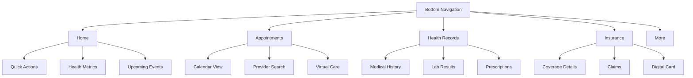

### 5.1.2 Core Screen Components

| Screen | Components | Functionality |
| --- | --- | --- |
| Home Dashboard | - Health metrics widgets<br>- Appointment reminders<br>- Action cards | - Real-time health data display<br>- One-tap appointment access<br>- Quick action triggers |
| Virtual Care | - Video interface<br>- Chat panel<br>- Document sharing | - WebRTC video streaming<br>- Real-time messaging<br>- Medical file exchange |
| Health Records | - Timeline view<br>- Category filters<br>- Document viewer | - Chronological record display<br>- Document categorization<br>- PDF/DICOM viewing |
| Claims Management | - Claim form<br>- Status tracker<br>- Document upload | - Guided claim submission<br>- Real-time status updates<br>- Document verification |

## 5.2 DATABASE DESIGN

### 5.2.1 Data Model

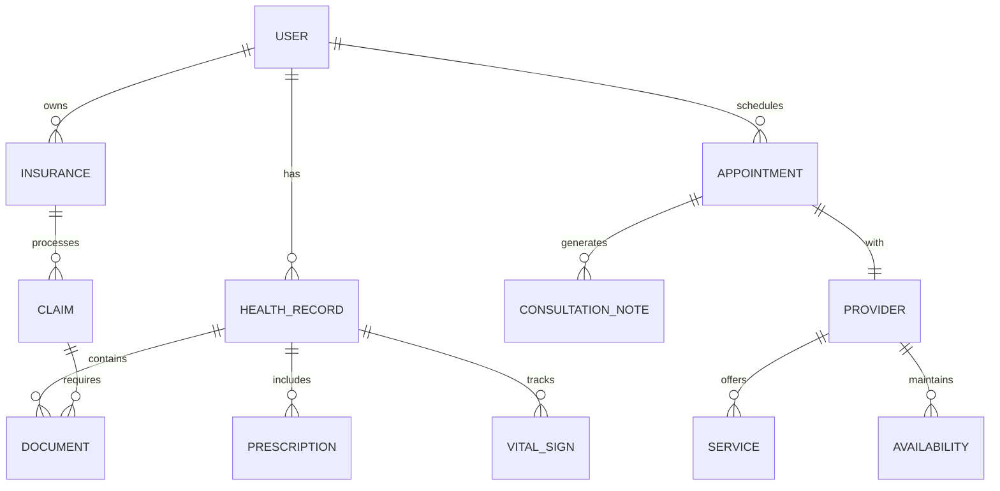

### 5.2.2 Storage Strategy

| Data Type | Storage Solution | Sharding Strategy |
| --- | --- | --- |
| User Profiles | PostgreSQL | Hash by user_id |
| Medical Records | MongoDB | Range by date |
| Media Files | S3-compatible | Geographic distribution |
| Real-time Data | Redis Cluster | Hash by session_id |
| Analytics | ClickHouse | Time-series partitioning |

### 5.2.3 Data Access Patterns

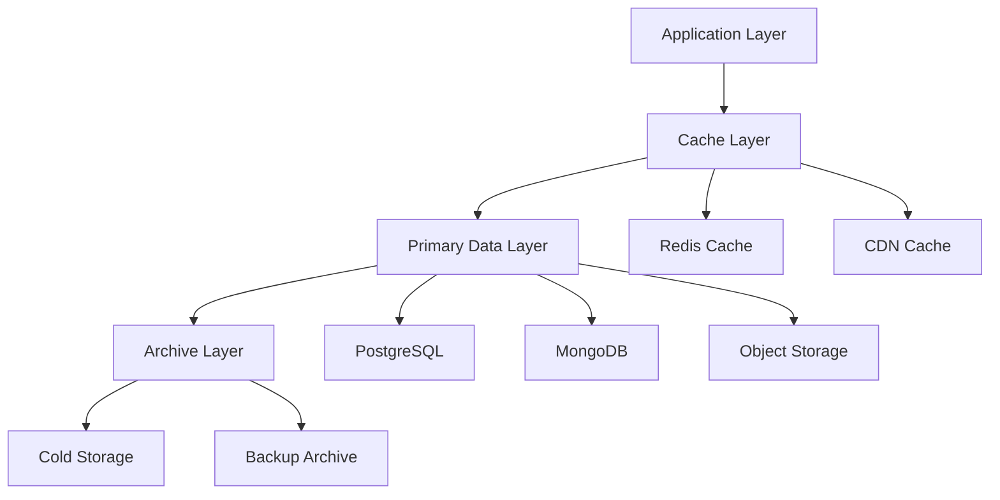

## 5.3 API DESIGN

### 5.3.1 API Architecture

| Service | Protocol | Authentication |
| --- | --- | --- |
| User Management | REST | JWT + OAuth2 |
| Health Records | GraphQL | OAuth2 + RBAC |
| Telemedicine | WebSocket | JWT + Session |
| Insurance | REST | OAuth2 + API Key |
| Analytics | gRPC | Service Account |

### 5.3.2 Core API Endpoints

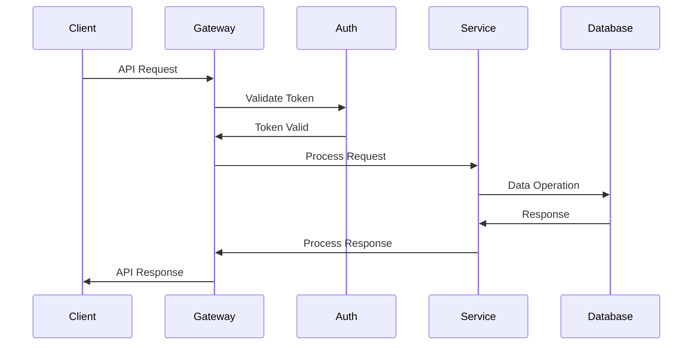

### 5.3.3 Integration Interfaces

| System | Integration Method | Data Format |
| --- | --- | --- |
| EHR Systems | HL7 FHIR | JSON/XML |
| Payment Gateway | REST | JSON |
| Insurance Claims | SOAP/REST | XML/JSON |
| Wearables | WebSocket | Binary/JSON |
| Analytics | Event Stream | Protobuf |

### 5.3.4 API Security

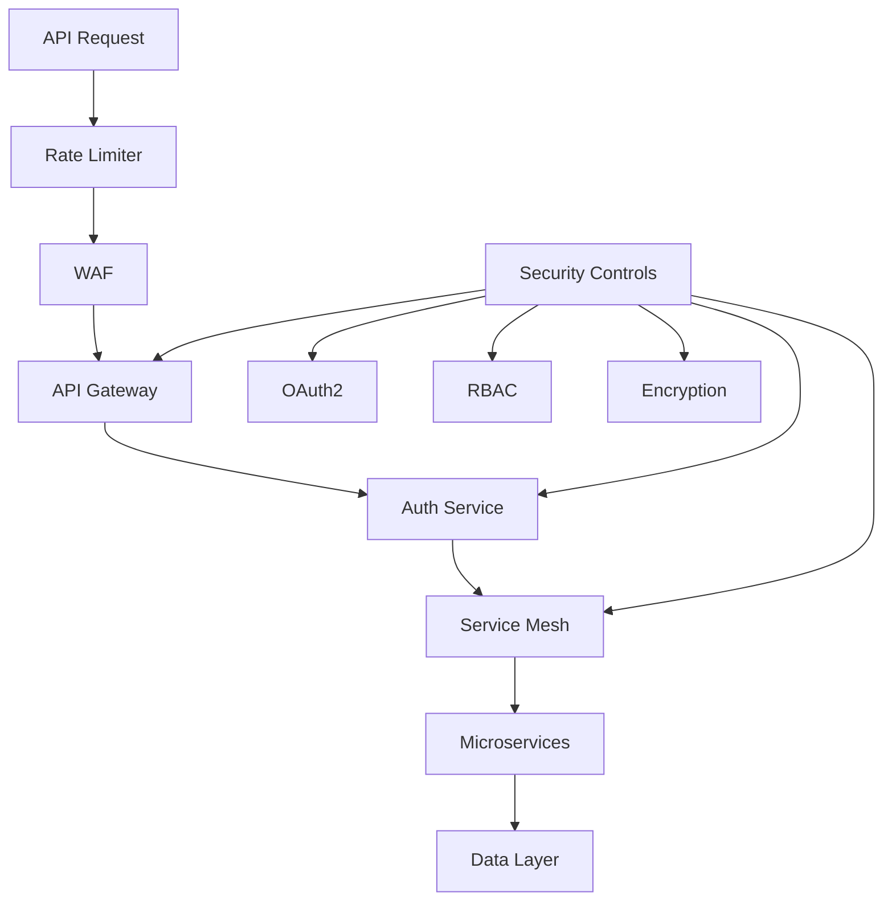

# 6. USER INTERFACE DESIGN

## 6.1 Common Components

### Navigation Bar

```
+----------------------------------------------------------+
| [@] Profile    [#] Dashboard    [$] Claims    [=] Settings |
+----------------------------------------------------------+
```

### Global Search

```
+----------------------------------------------------------+
| Search: [...........................] [Button: Search]      |
| Recent: Appointments, Prescriptions, Lab Results           |
+----------------------------------------------------------+
```

### Alert System

```
+----------------------------------------------------------+
| [!] System Alert                                          |
| Message text here                                    [x]   |
+----------------------------------------------------------+
```

## 6.2 Main Dashboard

```
+----------------------------------------------------------+
| AUSTA SuperApp Dashboard                [@] Dr. Smith      |
+----------------------------------------------------------+
| [#] Quick Actions         | [!] Notifications (3)          |
|                          |                                 |
| [+] New Appointment      | [*] Prescription Renewal Due    |
| [$] Submit Claim         | [!] Lab Results Available       |
| [@] Update Profile       | [i] Next Appointment Tomorrow   |
+--------------------------|                                 |
| Health Metrics           |                                 |
| [====] BP: 120/80       |                                 |
| [====] HR: 72 bpm       |---------------------------------+
| [====] Steps: 8,542     | Upcoming Appointments           |
+--------------------------|                                 |
| Recent Activities        | > Dr. Smith - Cardiology       |
| > Lab Results (2)        |   Tomorrow 14:00               |
| > Prescriptions (1)      | > Dr. Jones - General          |
| > Claims Status (3)      |   Next Week 10:30              |
+----------------------------------------------------------+
```

## 6.3 Virtual Care Interface

```
+----------------------------------------------------------+
| Telemedicine Session                              [x] End  |
+----------------------------------------------------------+
|                                                           |
|     +-------------------------+  +-----------------+       |
|     |                         |  |                 |       |
|     |     Doctor Video        |  |  Patient Video  |       |
|     |                         |  |                 |       |
|     +-------------------------+  +-----------------+       |
|                                                           |
| Controls:                                                 |
| [Button: Mute] [Button: Camera] [Button: Share] [Button: Chat] |
+----------------------------------------------------------+
| Chat Window:                                              |
| Dr: How are you feeling today?                           |
| You: Much better after the new medication                |
| [...................................] [Button: Send]      |
+----------------------------------------------------------+
```

## 6.4 Health Records View

```
+----------------------------------------------------------+
| Health Records                                    [^] Upload|
+----------------------------------------------------------+
| Categories:                  | Document Viewer             |
| [v] Filter by Type          |                             |
|                             | Lab Report - 2023-12-01     |
| +-- Medical History         | +-------------------------+ |
| |   +-- 2023               | |                         | |
| |   |   +-- Lab Reports    | |     PDF Preview         | |
| |   |   +-- Prescriptions  | |                         | |
| |   +-- 2022               | |                         | |
| |       +-- Imaging        | |                         | |
| |       +-- Consultations  | +-------------------------+ |
| +-- Medications            |                             |
|     +-- Current            | [Button: Download]          |
|     +-- Historical         | [Button: Share]             |
+----------------------------------------------------------+
```

## 6.5 Claims Management

```
+----------------------------------------------------------+
| Insurance Claims                          [+] New Claim    |
+----------------------------------------------------------+
| Active Claims:                                            |
|                                                          |
| Claim #12345                                             |
| +------------------------------------------------------+ |
| | Date: 2023-12-01                                     | |
| | Type: Medical Consultation                           | |
| | Amount: $150.00                                      | |
| | Status: [=====>    ] Processing                      | |
| | [Button: View Details] [Button: Upload Documents]    | |
| +------------------------------------------------------+ |
|                                                          |
| Claim #12344                                             |
| +------------------------------------------------------+ |
| | Date: 2023-11-28                                     | |
| | Type: Laboratory Tests                               | |
| | Amount: $275.00                                      | |
| | Status: [=========] Completed                        | |
| | [Button: View Details] [Button: Download Receipt]    | |
| +------------------------------------------------------+ |
+----------------------------------------------------------+
```

## 6.6 Symbol Key

| Symbol | Meaning |
| --- | --- |
| \[?\] | Help/Information tooltip |
| \[$\] | Financial/Payment related |
| \[i\] | Information indicator |
| \[+\] | Add new item |
| \[x\] | Close/Delete |
| \[\<\] \[\>\] | Navigation arrows |
| \[^\] | Upload function |
| \[#\] | Dashboard/Menu |
| \[@\] | User profile |
| \[!\] | Alert/Warning |
| \[=\] | Settings menu |
| \[\*\] | Important/Favorite |
| \[...\] | Text input field |
| \[====\] | Progress indicator |
| \[v\] | Dropdown menu |
| ( ) | Radio button |
| \[ \] | Checkbox |
| \[Button\] | Clickable button |

## 6.7 Responsive Breakpoints

| Device | Width | Layout Adjustments |
| --- | --- | --- |
| Mobile | 320px-767px | Single column, stacked components |
| Tablet | 768px-1023px | Two column, condensed navigation |
| Desktop | 1024px+ | Full layout with sidebars |

## 6.8 Accessibility Features

- High contrast mode support
- Screen reader compatibility
- Keyboard navigation
- Minimum touch target size: 44x44px
- WCAG 2.1 Level AA compliance
- Font size adjustments
- Color blind friendly palette

## 6.9 Interaction States

```
Button States:
+---------------+  +---------------+  +---------------+
| [  Normal  ]  |  | [  Hover   ] |  | [ Disabled ] |
+---------------+  +---------------+  +---------------+

Input States:
+---------------+  +---------------+  +---------------+
| [ Default  ]  |  | [ Focus   ]  |  | [ Error   ]  |
+---------------+  +---------------+  +---------------+
```

# 7. SECURITY CONSIDERATIONS

## 7.1 AUTHENTICATION AND AUTHORIZATION

### Authentication Methods

| Method | Implementation | Use Case |
| --- | --- | --- |
| OAuth 2.0 + OIDC | Auth0 integration | Primary authentication flow |
| Biometric | Native iOS/Android APIs | Mobile app access |
| MFA | SMS/Email/Authenticator | High-risk operations |
| JWT | Short-lived tokens (15min) | API authentication |
| Session Management | Redis cluster | Web application state |

### Authorization Framework

```mermaid
graph TD
    A[User Request] --> B{Authentication}
    B -->|Success| C{Authorization}
    B -->|Failure| D[Access Denied]
    
    C -->|Permitted| E[Access Resource]
    C -->|Denied| D
    
    subgraph "RBAC System"
    F[Role Definitions]
    G[Permission Sets]
    H[Resource Access]
    end
    
    C --> F
    F --> G
    G --> H
```

### Role-Based Access Control Matrix

| Role | Health Records | Claims | Admin Console | Marketplace |
| --- | --- | --- | --- | --- |
| Patient | Read Own | Submit/View Own | No Access | Full Access |
| Provider | Read Assigned | View Related | Limited Access | Manage Services |
| Admin | Full Access | Full Access | Full Access | Full Access |
| Insurance | Limited Read | Full Access | Limited Access | No Access |

## 7.2 DATA SECURITY

### Encryption Standards

| Layer | Method | Key Management |
| --- | --- | --- |
| Data at Rest | AES-256-GCM | AWS KMS/Azure Key Vault |
| Data in Transit | TLS 1.3 | Automated certificate rotation |
| Database | Column-level encryption | Hardware Security Module |
| Backup | AES-256 | Separate key hierarchy |

### Data Classification

```mermaid
graph LR
    A[Data Input] --> B{Classification Engine}
    B -->|PHI| C[High Security]
    B -->|PII| D[Medium Security]
    B -->|Public| E[Standard Security]
    
    C --> F[Encryption]
    C --> G[Access Logging]
    C --> H[Backup]
    
    D --> F
    D --> G
    
    E --> I[Basic Protection]
```

### Data Protection Measures

| Category | Implementation | Monitoring |
| --- | --- | --- |
| PHI/PII Detection | ML-based scanning | Real-time alerts |
| Access Control | Attribute-based (ABAC) | Audit logging |
| Data Masking | Dynamic field masking | Policy compliance |
| Backup Encryption | Independent keys | Integrity verification |
| Data Lifecycle | Automated retention | Compliance reporting |

## 7.3 SECURITY PROTOCOLS

### Network Security

```mermaid
graph TD
    A[Internet] --> B[WAF]
    B --> C[Load Balancer]
    C --> D[API Gateway]
    
    D --> E{Service Mesh}
    E --> F[Microservices]
    F --> G[Databases]
    
    subgraph Security Controls
    H[IDS/IPS]
    I[DDoS Protection]
    J[Network Segmentation]
    end
    
    B --> H
    C --> I
    E --> J
```

### Security Monitoring

| Component | Tool | Purpose |
| --- | --- | --- |
| SIEM | ELK Stack | Log aggregation and analysis |
| Threat Detection | Snort/Suricata | Network intrusion detection |
| Vulnerability Scanning | SonarQube/OWASP ZAP | Code and dependency scanning |
| Performance Monitoring | Prometheus/Grafana | Security metrics tracking |
| Incident Response | PagerDuty | Alert management |

### Compliance Controls

| Requirement | Implementation | Validation |
| --- | --- | --- |
| HIPAA | PHI encryption, access controls | Annual audit |
| LGPD | Consent management, data minimization | Quarterly review |
| PCI DSS | Tokenization, secure transmission | Monthly scan |
| SOC 2 | Security controls, monitoring | Continuous assessment |
| ISO 27001 | ISMS framework | Annual certification |

### Security Response Procedures

```mermaid
graph LR
    A[Security Event] --> B{Severity Assessment}
    B -->|High| C[Immediate Response]
    B -->|Medium| D[Standard Protocol]
    B -->|Low| E[Routine Handling]
    
    C --> F[Incident Team]
    C --> G[Executive Notice]
    C --> H[System Lockdown]
    
    D --> I[Security Team]
    D --> J[Investigation]
    
    E --> K[Logging]
    E --> L[Monitoring]
```

# 8. INFRASTRUCTURE

## 8.1 DEPLOYMENT ENVIRONMENT

### Environment Strategy

| Environment | Purpose | Configuration |
| --- | --- | --- |
| Development | Feature development, unit testing | Single region, minimal redundancy |
| Staging | Integration testing, UAT | Multi-AZ, production-like setup |
| Production | Live system operation | Multi-region, full redundancy |
| DR | Disaster recovery | Hot standby in alternate region |

### Regional Distribution

```mermaid
graph TB
    subgraph Primary Region
    A[Load Balancer] --> B[API Gateway]
    B --> C[Service Mesh]
    C --> D[Microservices]
    D --> E[Data Layer]
    end
    
    subgraph DR Region
    A2[Load Balancer] --> B2[API Gateway]
    B2 --> C2[Service Mesh]
    C2 --> D2[Microservices]
    D2 --> E2[Data Layer]
    end
    
    E -.-> E2[Data Sync]
    
    subgraph Edge Locations
    F1[CDN Edge]
    F2[CDN Edge]
    F3[CDN Edge]
    end
    
    F1 & F2 & F3 --> A & A2
```

## 8.2 CLOUD SERVICES

### Primary Cloud Provider: AWS

| Service Category | AWS Service | Purpose |
| --- | --- | --- |
| Compute | EKS, EC2 | Container orchestration, VM instances |
| Storage | S3, EBS | Object storage, block storage |
| Database | RDS, DynamoDB | Relational DB, NoSQL DB |
| Caching | ElastiCache | Session management, data caching |
| CDN | CloudFront | Global content delivery |
| Security | KMS, WAF | Key management, web application firewall |

### Secondary Provider: Azure (DR)

| Service Category | Azure Service | Purpose |
| --- | --- | --- |
| Compute | AKS | Kubernetes service for DR |
| Storage | Blob Storage | Object storage backup |
| Database | Azure Database | Database failover |
| Network | Front Door | Global load balancing |

## 8.3 CONTAINERIZATION

### Container Architecture

```mermaid
graph TD
    A[Base Images] --> B[Service Images]
    B --> C[Development]
    B --> D[Staging]
    B --> E[Production]
    
    subgraph Image Layers
    F[Alpine Linux Base]
    G[Runtime Layer]
    H[Dependencies]
    I[Application Code]
    end
    
    F --> G --> H --> I
    
    subgraph Security
    J[Image Scanning]
    K[Policy Enforcement]
    L[SBOM Generation]
    end
    
    B --> J --> K --> L
```

### Container Standards

| Component | Specification | Purpose |
| --- | --- | --- |
| Base Image | Alpine Linux | Minimal attack surface |
| Runtime | OpenJDK, Node.js | Application execution |
| Registry | ECR | Image storage and distribution |
| Security | Trivy, Snyk | Vulnerability scanning |

## 8.4 ORCHESTRATION

### Kubernetes Architecture

```mermaid
graph TB
    subgraph Control Plane
    A[API Server] --> B[Controller Manager]
    A --> C[Scheduler]
    A --> D[etcd]
    end
    
    subgraph Worker Nodes
    E[kubelet] --> F[Container Runtime]
    E --> G[kube-proxy]
    end
    
    subgraph Add-ons
    H[Istio]
    I[Prometheus]
    J[External DNS]
    end
    
    A --> E
    H & I & J --> A
```

### Cluster Configuration

| Component | Tool/Service | Purpose |
| --- | --- | --- |
| Service Mesh | Istio | Traffic management, security |
| Monitoring | Prometheus/Grafana | Metrics and visualization |
| Scaling | HPA/VPA | Auto-scaling management |
| Secrets | Vault | Secrets management |
| Ingress | NGINX Ingress | Load balancing |

## 8.5 CI/CD PIPELINE

### Pipeline Architecture

```mermaid
graph LR
    A[Source Code] --> B[Build]
    B --> C[Test]
    C --> D[Security Scan]
    D --> E[Package]
    E --> F[Deploy]
    
    subgraph Quality Gates
    G[Unit Tests]
    H[Integration Tests]
    I[Security Checks]
    J[Performance Tests]
    end
    
    C --> G & H
    D --> I
    E --> J
```

### Pipeline Components

| Stage | Tools | Purpose |
| --- | --- | --- |
| Source Control | GitHub | Code repository |
| CI Server | GitHub Actions | Build automation |
| Artifact Storage | ECR, S3 | Binary storage |
| Deployment | ArgoCD | GitOps deployment |
| Testing | JUnit, Jest | Automated testing |
| Security | SonarQube, OWASP | Code analysis |

### Deployment Strategy

| Type | Method | Use Case |
| --- | --- | --- |
| Blue/Green | Full environment swap | Major releases |
| Canary | Gradual traffic shift | Feature validation |
| Rolling | Progressive update | Regular updates |
| Hotfix | Direct deployment | Critical fixes |

# APPENDICES

## A. ADDITIONAL TECHNICAL INFORMATION

### A.1 Health Data Standards Implementation

| Standard | Implementation Details | Integration Points |
| --- | --- | --- |
| HL7 FHIR R4 | - Resource validation<br>- Custom extensions<br>- Bulk data operations | - EHR systems<br>- Lab systems<br>- Pharmacy networks |
| DICOM | - Image storage<br>- Viewer integration<br>- Metadata handling | - Imaging centers<br>- Radiology systems |
| SNOMED CT | - Clinical terminology<br>- Code mapping<br>- Search optimization | - Diagnosis coding<br>- Clinical documentation |

### A.2 Backup and Recovery Matrix

```mermaid
graph TD
    A[Backup Types] --> B[Real-time Replication]
    A --> C[Incremental Backup]
    A --> D[Full Backup]
    
    B --> E[Hot Standby]
    B --> F[Transaction Logs]
    
    C --> G[Daily Deltas]
    C --> H[Change Tracking]
    
    D --> I[Weekly Full Copy]
    D --> J[Monthly Archive]
    
    subgraph "Recovery Scenarios"
    K[Point-in-Time]
    L[Disaster Recovery]
    M[Data Corruption]
    end
    
    E --> K & L
    F --> K
    G --> M
    I --> L
```

### A.3 Integration Architecture

```mermaid
graph LR
    A[External Systems] --> B{API Gateway}
    B --> C[Auth Service]
    B --> D[Integration Layer]
    
    D --> E[EHR Adapter]
    D --> F[Payment Adapter]
    D --> G[Insurance Adapter]
    
    subgraph "Data Transformation"
    H[Protocol Translation]
    I[Data Mapping]
    J[Validation]
    end
    
    E & F & G --> H --> I --> J
```

## B. GLOSSARY

| Term | Definition |
| --- | --- |
| Attribute-Based Access Control | Security paradigm that grants access based on user attributes and environmental conditions |
| Blue/Green Deployment | Deployment strategy using two identical environments for zero-downtime updates |
| Canary Release | Gradual rollout of changes to a subset of users before full deployment |
| Circuit Breaker | Design pattern that prevents cascading failures in distributed systems |
| Dead Letter Queue | Storage for messages that cannot be processed successfully |
| Event Sourcing | Pattern of storing state changes as a sequence of events |
| Feature Toggle | System allowing features to be enabled/disabled without code deployment |
| Hot Standby | Backup system that maintains real-time synchronization with production |
| Immutable Infrastructure | Practice of replacing rather than modifying infrastructure components |
| Service Mesh | Infrastructure layer handling service-to-service communication |

## C. ACRONYMS

| Acronym | Full Form |
| --- | --- |
| ABAC | Attribute-Based Access Control |
| CQRS | Command Query Responsibility Segregation |
| DLQ | Dead Letter Queue |
| ELK | Elasticsearch, Logstash, Kibana |
| FHIR | Fast Healthcare Interoperability Resources |
| gRPC | Google Remote Procedure Call |
| HSTS | HTTP Strict Transport Security |
| IaC | Infrastructure as Code |
| JWT | JSON Web Token |
| K8s | Kubernetes |
| mTLS | Mutual Transport Layer Security |
| OIDC | OpenID Connect |
| PII | Personally Identifiable Information |
| RBAC | Role-Based Access Control |
| RPO | Recovery Point Objective |
| RTO | Recovery Time Objective |
| SBOM | Software Bill of Materials |
| SLA | Service Level Agreement |
| SOC | System and Organization Controls |
| WAF | Web Application Firewall |
| WSS | WebSocket Secure |

## D. REFERENCE ARCHITECTURE

```mermaid
graph TB
    subgraph "Frontend Layer"
    A[Mobile Apps]
    B[Web Apps]
    end
    
    subgraph "API Layer"
    C[API Gateway]
    D[Load Balancer]
    end
    
    subgraph "Service Layer"
    E[Auth Service]
    F[Health Records]
    G[Virtual Care]
    H[Claims Service]
    end
    
    subgraph "Data Layer"
    I[PostgreSQL]
    J[MongoDB]
    K[Redis]
    L[Elasticsearch]
    end
    
    A & B --> C
    C --> D
    D --> E & F & G & H
    E & F & G & H --> I & J & K & L
```