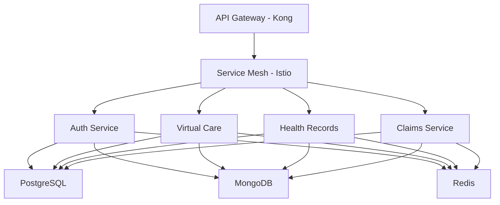

# AUSTA SuperApp Backend

## Overview

AUSTA SuperApp is an enterprise-grade healthcare platform built with a microservices architecture, providing comprehensive healthcare services while maintaining strict HIPAA and LGPD compliance. This backend system powers virtual care delivery, health records management, insurance operations, and digital therapeutic services.

## Prerequisites

### System Requirements
- Node.js >= 18.0.0
- Docker >= 24.0.0
- Kubernetes >= 1.27
- Helm >= 3.11

### Security Requirements
- Valid SSL certificates
- HIPAA compliance training completion
- Security key pairs for encryption
- Access to approved key management service

## Architecture

### Core Components


### Service Ports
- API Gateway: 3000
- Auth Service: 3001
- Virtual Care: 3002
- Health Records: 3003

### Database Infrastructure
- PostgreSQL 15 (HIPAA-compliant primary database)
- MongoDB 6.0 (FHIR-compliant document store)
- Redis 7.0 (Session management)

## Setup Instructions

### 1. Environment Configuration
```bash
# Clone the repository
git clone https://github.com/your-org/austa-superapp.git
cd austa-superapp/backend

# Install dependencies
npm install

# Copy environment template
cp .env.example .env

# Configure environment variables
vim .env
```

### 2. Database Setup
```bash
# Start database containers
docker-compose up -d postgres mongodb redis

# Run migrations
npm run migrate:up

# Seed initial data
npm run seed:dev
```

### 3. Service Deployment
```bash
# Build services
npm run build

# Start development environment
npm run dev

# Start production environment
npm run start:prod
```

## Security Implementation

### HIPAA Compliance
- End-to-end encryption for PHI
- Audit logging for all data access
- Role-based access control (RBAC)
- Automatic session termination
- Encrypted backup procedures

### LGPD Requirements
- Explicit consent management
- Data minimization practices
- Right to erasure implementation
- Data portability support
- Privacy impact assessments

### Security Measures
- TLS 1.3 for all communications
- JWT with short expiration (15 minutes)
- IP whitelisting for admin access
- Regular security scanning
- Intrusion detection system

## API Documentation

### Authentication
```typescript
POST /api/v1/auth/login
POST /api/v1/auth/refresh
POST /api/v1/auth/logout
```

### Health Records (FHIR R4)
```typescript
GET /api/v1/fhir/Patient
GET /api/v1/fhir/Observation
POST /api/v1/fhir/DocumentReference
```

### Virtual Care
```typescript
POST /api/v1/virtual/sessions
GET /api/v1/virtual/sessions/{id}
POST /api/v1/virtual/prescriptions
```

## Development Guidelines

### Code Standards
- ESLint configuration for TypeScript
- Prettier for code formatting
- Jest for unit testing
- Swagger for API documentation

### Git Workflow
```bash
# Create feature branch
git checkout -b feature/AUSTA-123-feature-name

# Commit with conventional commits
git commit -m "feat(module): implement feature"

# Submit pull request
git push origin feature/AUSTA-123-feature-name
```

### Testing Requirements
- Unit test coverage > 80%
- Integration tests for FHIR endpoints
- Security testing with OWASP ZAP
- Performance testing with k6

## Monitoring and Logging

### Observability Stack
- Prometheus for metrics
- ELK Stack for logs
- Jaeger for tracing
- Grafana for visualization

### Health Checks
```typescript
GET /health/live
GET /health/ready
GET /health/version
```

## Deployment

### Kubernetes Deployment
```bash
# Deploy to development
kubectl apply -f k8s/dev/

# Deploy to staging
kubectl apply -f k8s/staging/

# Deploy to production
kubectl apply -f k8s/prod/
```

### CI/CD Pipeline
- GitHub Actions for automation
- SonarQube for code quality
- Snyk for dependency scanning
- ArgoCD for GitOps deployment

## Support and Maintenance

### Troubleshooting
- Check service logs: `kubectl logs -f service-pod`
- Monitor metrics: `http://grafana.local`
- View traces: `http://jaeger.local`

### Backup Procedures
- Daily automated backups
- Point-in-time recovery
- Geo-redundant storage
- Encrypted backup validation

## License

Copyright © 2023 AUSTA SuperApp. All rights reserved.

## Contact

For technical support:
- Email: tech-support@austa-superapp.com
- Slack: #austa-backend-support