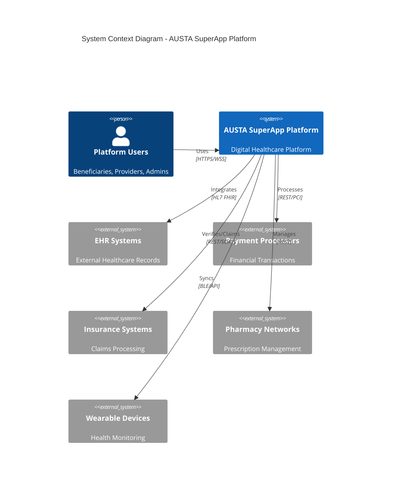
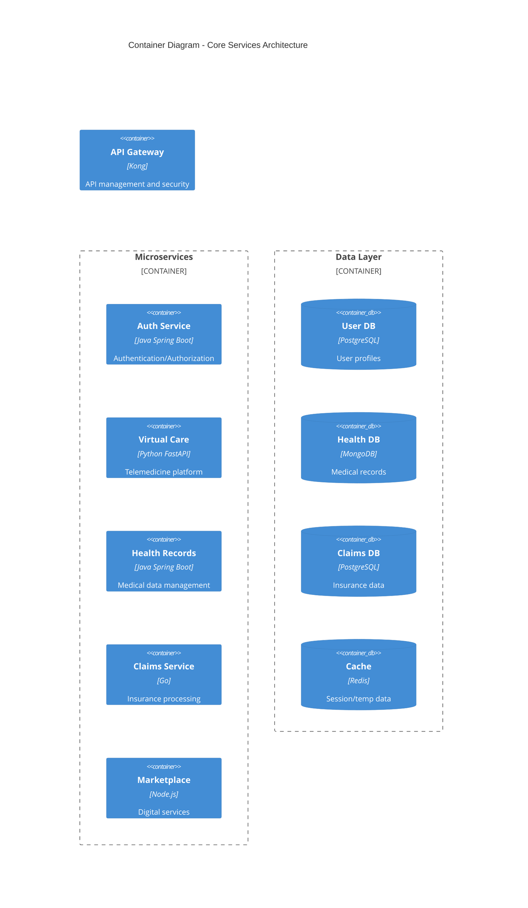
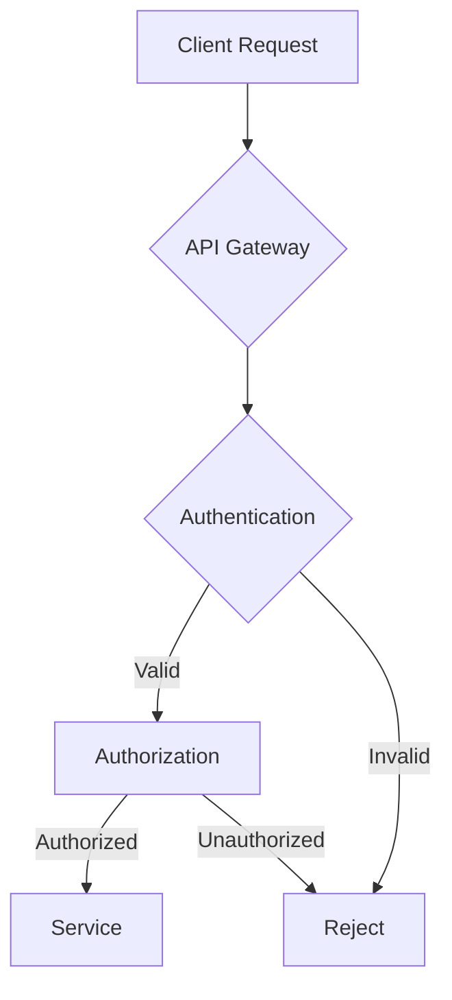
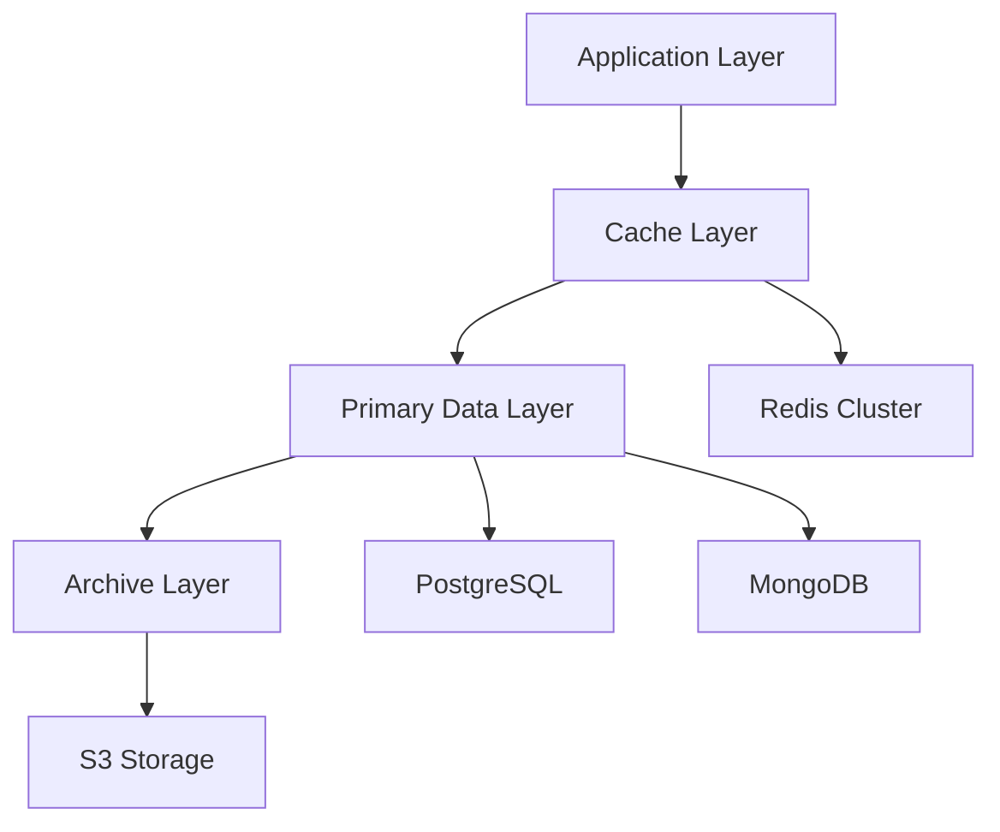
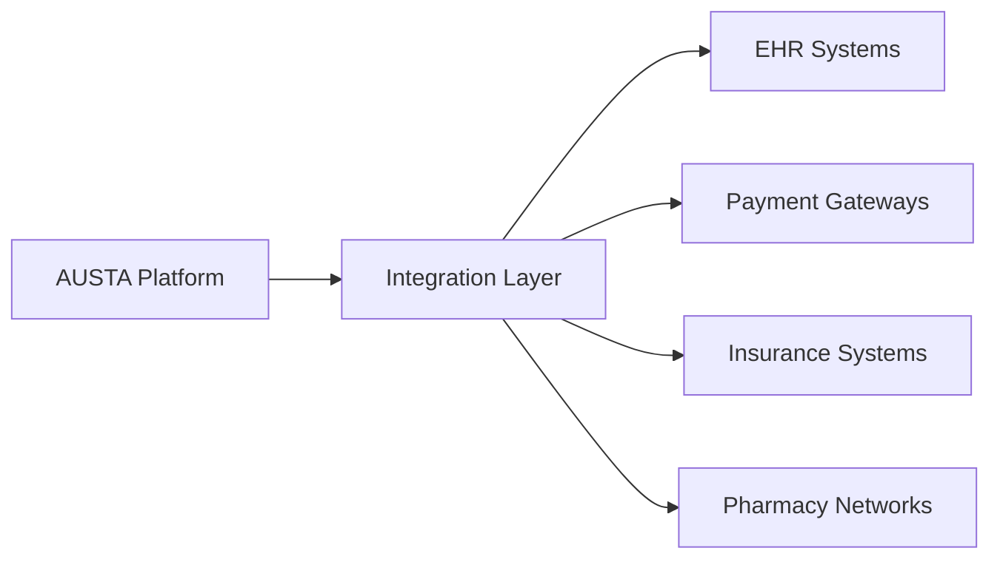
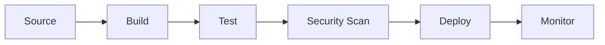

# AUSTA SuperApp System Architecture Documentation

## Table of Contents
1. [System Overview](#system-overview)
2. [Microservices Architecture](#microservices-architecture)
3. [Security Architecture](#security-architecture)
4. [API Architecture](#api-architecture)
5. [Data Architecture](#data-architecture)
6. [Integration Architecture](#integration-architecture)
7. [Operational Architecture](#operational-architecture)

## 1. System Overview



### Technology Stack
- **Backend Services**: Java 17 LTS, Go 1.21+, Python 3.11+
- **Frontend**: TypeScript 5.0+, React 18, Next.js 13
- **Mobile**: Swift 5.9+ (iOS), Kotlin 1.9+ (Android)
- **Data Storage**: PostgreSQL 15+, MongoDB 6.0+, Redis 7.0+
- **Infrastructure**: Kubernetes 1.27+, Docker 24.0+, Istio 1.19+

## 2. Microservices Architecture



### Service Components
- **Auth Service**: OAuth2/OIDC implementation, MFA, session management
- **Virtual Care**: WebRTC integration, real-time communication
- **Health Records**: FHIR R4 compliance, document management
- **Claims Service**: Insurance processing, payment integration
- **Marketplace**: Service discovery, provider management

## 3. Security Architecture

### Authentication & Authorization


### Security Controls
- **Encryption**: AES-256-GCM for data at rest
- **Transport**: TLS 1.3 with strong cipher suites
- **Access Control**: RBAC with granular permissions
- **Audit**: Comprehensive logging of all security events
- **Compliance**: HIPAA and LGPD requirements implementation

## 4. API Architecture

### API Gateway Configuration
```yaml
security:
  - OAuth2:
      flows:
        authorizationCode:
          authorizationUrl: https://auth.austa.health/oauth/authorize
          tokenUrl: https://auth.austa.health/oauth/token
  - BearerAuth:
      type: http
      scheme: bearer
      bearerFormat: JWT
  - mTLS:
      type: mutualTLS
```

### Rate Limiting
- Standard Users: 1000 requests/minute
- Premium Users: 5000 requests/minute
- Burst: 150% of base limit

## 5. Data Architecture

### Data Flow Patterns


### Storage Strategy
- **User Data**: PostgreSQL with encryption
- **Medical Records**: MongoDB with FHIR support
- **Session Data**: Redis Cluster
- **Media Files**: S3-compatible storage

## 6. Integration Architecture

### External System Integration


### Integration Patterns
- **Synchronous**: REST/GraphQL APIs
- **Asynchronous**: Event-driven architecture
- **File Transfer**: SFTP with encryption
- **Messaging**: Apache Kafka for events

## 7. Operational Architecture

### Monitoring Stack
- **Metrics**: Prometheus/Grafana
- **Logging**: ELK Stack
- **Tracing**: Jaeger
- **Alerting**: PagerDuty

### Deployment Pipeline


### Infrastructure Management
- **IaC**: Terraform for provisioning
- **GitOps**: ArgoCD for deployments
- **Secrets**: HashiCorp Vault
- **Networking**: Istio service mesh